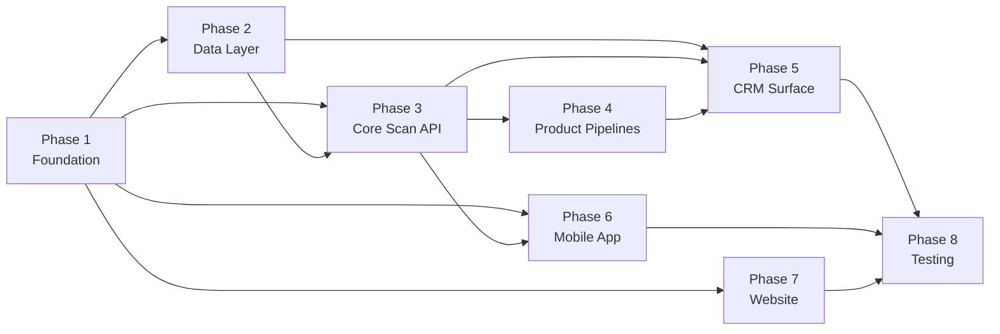

# GAIA (GABI Steward 2.0) — Barker Build Plan

**Project:** Philippine agrochemical traceability platform (website + CRM + mobile + scan pipeline)
**Stack:** Turborepo + pnpm, Next.js 14, Expo SDK 51+, Supabase (Postgres 15 + Auth + Storage + RLS)
**Plan date:** 2026-04-24
**Author:** Tony Stark ⚡

---

## YAML

```yaml
project:
  name: "gaia"
  description: "Philippine agrochemical traceability — website + CRM + farmer mobile app + scan pipeline"
  working_directory: "."

input_files:
  - path: "prd.md"
    alias: "prd"
    description: "Product requirements — 10-phase build plan, data model, feature specs"
  - path: "tech-spec.md"
    alias: "tech-spec"
    description: "Architecture, data model with DDL, sequence diagrams, deployment, SLOs"
  - path: "api-spec.md"
    alias: "api-spec"
    description: "REST contracts — endpoints, schemas, error codes, OpenAPI appendix"
  - path: "ui-design.md"
    alias: "ui-design"
    description: "Design system, screen inventory, component patterns across 3 surfaces"

# ============================================================
# PHASE 1 — FOUNDATION
# Monorepo scaffold, shared design tokens, shared i18n,
# TypeScript types, Supabase client. No business logic yet.
# ============================================================
phases:
  - id: "phase-1"
    name: "Foundation"
    description: "Monorepo scaffold, shared packages (tokens, i18n, types), Supabase client"
    phase_check: "pnpm install && pnpm -r build --filter='./packages/*'"
    tasks:
      - id: "p1-monorepo"
        name: "Turborepo + pnpm workspace scaffold"
        model: "sonnet"
        depends_on: []
        estimated_minutes: 15
        context_sources:
          - alias: "tech-spec"
            sections: ["4.1", "4.2"]
        prompt: |
          Initialize a Turborepo monorepo with pnpm workspaces at the repo root.

          Structure:
          - `apps/website/` — placeholder package.json (Next.js 14 scaffold comes later)
          - `apps/crm/` — placeholder package.json
          - `apps/mobile/` — placeholder package.json (Expo scaffold comes later)
          - `packages/shared/` — cross-platform utilities + tokens + i18n
          - `packages/supabase/` — generated types + client factories

          Deliver:
          - Root `package.json` with `packageManager: "pnpm@9.x"`, `"private": true`
          - `pnpm-workspace.yaml` listing `apps/*` and `packages/*`
          - `turbo.json` with pipelines: `build`, `dev`, `lint`, `typecheck`, `test`
          - Root `tsconfig.base.json` with strict mode, `noUncheckedIndexedAccess`, `exactOptionalPropertyTypes`
          - Root `.gitignore` (node_modules, .turbo, dist, .env*, .expo, .next)
          - Root `.nvmrc` with Node 20 LTS
          - Root `README.md` with one-paragraph project description + `pnpm install && pnpm dev` quickstart

          Hardening requirements:
          - tsconfig strict mode enabled at the base level
          - `.env.example` at root listing required env vars as stubs: SUPABASE_URL, SUPABASE_ANON_KEY, SUPABASE_SERVICE_ROLE_KEY, HMAC_SECRET, OCR_PROVIDER, GEMINI_API_KEY, ANTHROPIC_API_KEY, TWILIO_ACCOUNT_SID, TWILIO_AUTH_TOKEN, SMS_FALLBACK_PROVIDER
          - Never commit .env (listed in .gitignore)
          - turbo.json uses `"$schema"` reference so editors validate
        expected_files:
          - "package.json"
          - "pnpm-workspace.yaml"
          - "turbo.json"
          - "tsconfig.base.json"
          - ".gitignore"
          - ".nvmrc"
          - "README.md"
          - ".env.example"
        done_check: "test -f pnpm-workspace.yaml && test -f turbo.json && test -f tsconfig.base.json"

      - id: "p1-tokens"
        name: "Shared design tokens (colors, typography, spacing, radii, shadows)"
        model: "sonnet"
        depends_on: ["p1-monorepo"]
        estimated_minutes: 15
        context_sources:
          - alias: "ui-design"
            sections: ["Design System"]
          - alias: "tech-spec"
            sections: ["4.5"]
        prompt: |
          Build `packages/shared/tokens/` — the cross-platform design token source of truth consumed
          by web (Tailwind), CRM (Tailwind + shadcn), and mobile (React Native StyleSheet).

          Deliver:
          - `packages/shared/tokens/colors.ts` — exports brand, functional, and neutral scales. Brand green `#1A3D2E`, success green `#2E7D4F` (keep distinct per UI design), plus amber warning and red error scales. Include counterfeit-warning red, safety-gate amber.
          - `packages/shared/tokens/typography.ts` — Playfair Display (headings), Inter (body, CRM+mobile), size scale (xs→5xl), weights, line-heights
          - `packages/shared/tokens/spacing.ts` — 8px base scale (0, 1, 2, 3, 4, 6, 8, 10, 12, 16, 20, 24)
          - `packages/shared/tokens/radii.ts` — sm 4, md 8, lg 12, xl 16, full 9999
          - `packages/shared/tokens/shadows.ts` — elevation scale (0-4) with platform-portable values (string CSS for web, numeric elevation for RN)
          - `packages/shared/tokens/transitions.ts` — standard durations (fast 120ms, base 200ms, slow 320ms) + easings
          - `packages/shared/tokens/index.ts` — re-exports all
          - `packages/shared/package.json` with `"name": "@gaia/shared"`, `"type": "module"`, proper `exports` map
          - `packages/shared/tsconfig.json` extending `../../tsconfig.base.json`

          Export everything as plain TypeScript objects (not CSS strings) so mobile can consume. Web will
          wire these into Tailwind in a later task.

          Hardening requirements:
          - All exports are `as const` so types are literal unions (enables compile-time checks)
          - No hardcoded hex in any other package going forward — this is the single source
          - Include a header comment in colors.ts documenting: brand ≠ success, and why (per UI design)
        expected_files:
          - "packages/shared/tokens/colors.ts"
          - "packages/shared/tokens/typography.ts"
          - "packages/shared/tokens/spacing.ts"
          - "packages/shared/tokens/radii.ts"
          - "packages/shared/tokens/shadows.ts"
          - "packages/shared/tokens/transitions.ts"
          - "packages/shared/tokens/index.ts"
          - "packages/shared/package.json"
          - "packages/shared/tsconfig.json"
        done_check: "test -f packages/shared/tokens/index.ts && test -f packages/shared/tokens/colors.ts"

      - id: "p1-i18n"
        name: "Shared i18n keys (en + tl stub)"
        model: "sonnet"
        depends_on: ["p1-monorepo"]
        estimated_minutes: 10
        context_sources:
          - alias: "tech-spec"
            sections: ["4.5"]
          - alias: "api-spec"
            sections: ["2.4"]
        prompt: |
          Build `packages/shared/i18n/` — shared locale keys used by all three surfaces.

          Deliver:
          - `packages/shared/i18n/en.json` — full English key set organized under namespaces:
            - `errors.*` (matches api-spec error codes: INVALID_HMAC, ALREADY_CLAIMED, EXPIRED, CLOCK_SKEW, RATE_LIMITED, INTERNAL_ERROR, etc.)
            - `scan.*` (outcome messages for purchase_dealer, purchase_farmer, return_dealer, return_farmer)
            - `wallet.*` (balance, transactions, redeem)
            - `ocr.*` (safety gate warnings, confidence prompts)
            - `common.*` (buttons, states: loading, error, empty, retry, cancel, confirm)
          - `packages/shared/i18n/tl.json` — Tagalog stub with same key structure, most values set to English (translator fills later). Critical safety messages (counterfeit warning, poison category) MUST be translated now.
          - `packages/shared/i18n/types.ts` — TypeScript type derived from en.json for compile-time key validation
          - `packages/shared/i18n/index.ts` — exports both locales and the type

          Hardening requirements:
          - tl.json must have exactly the same key structure as en.json (no missing keys) — a unit test will verify this later
          - Safety-critical keys (counterfeit, poison toxicity I/II) are fully translated, not English placeholder — document this convention in a top-of-file comment in tl.json
          - No interpolation syntax yet — just static strings. Placeholders later.
        expected_files:
          - "packages/shared/i18n/en.json"
          - "packages/shared/i18n/tl.json"
          - "packages/shared/i18n/types.ts"
          - "packages/shared/i18n/index.ts"
        done_check: "test -f packages/shared/i18n/en.json && test -f packages/shared/i18n/tl.json"

      - id: "p1-shared-types"
        name: "Shared domain types (enums, ID brands, DTOs)"
        model: "sonnet"
        depends_on: ["p1-monorepo"]
        estimated_minutes: 15
        context_sources:
          - alias: "tech-spec"
            sections: ["4.3"]
          - alias: "api-spec"
            sections: ["6", "7", "8", "10", "11"]
        prompt: |
          Build `packages/shared/types/` — domain type definitions shared between frontend and backend.

          Deliver:
          - `packages/shared/types/enums.ts` — TypeScript string enums mirroring Postgres enums:
            container_state, product_status, actor_type, scan_step, scan_outcome, formulation_type,
            toxicity_category, product_type, voucher_denomination
          - `packages/shared/types/ids.ts` — branded types: UserId, ContainerId, ProductId, DealerId, ScanAttemptId (using `type X = string & { readonly __brand: 'X' }` pattern)
          - `packages/shared/types/scan.ts` — ScanRequest + discriminated ScanResponse union (outcome tag: 'success' | 'pending_confirmation' | 'rejected', with narrowed payload per variant)
          - `packages/shared/types/product.ts` — Product, ProductCrop DTOs
          - `packages/shared/types/wallet.ts` — Wallet, WalletTransaction DTOs
          - `packages/shared/types/errors.ts` — ApiError shape matching api-spec §2.2 (code, message, field?, details?)
          - `packages/shared/types/pagination.ts` — CursorPageRequest, CursorPageResponse<T> generics
          - `packages/shared/types/index.ts` — barrel export

          Hardening requirements:
          - All enums `as const` + `type X = typeof X[keyof typeof X]` pattern (no native TS enums — they don't tree-shake)
          - Discriminated unions use `outcome` as the tag field to match api-spec exactly
          - No `any`. No `unknown` unless at JSON boundary. Use `Readonly<>` for response DTOs.
        expected_files:
          - "packages/shared/types/enums.ts"
          - "packages/shared/types/ids.ts"
          - "packages/shared/types/scan.ts"
          - "packages/shared/types/product.ts"
          - "packages/shared/types/wallet.ts"
          - "packages/shared/types/errors.ts"
          - "packages/shared/types/pagination.ts"
          - "packages/shared/types/index.ts"
        done_check: "test -f packages/shared/types/index.ts"

      - id: "p1-supabase-pkg"
        name: "Supabase client package + env validation"
        model: "sonnet"
        depends_on: ["p1-monorepo"]
        estimated_minutes: 10
        context_sources:
          - alias: "tech-spec"
            sections: ["4.2", "6"]
        prompt: |
          Build `packages/supabase/` — typed Supabase client factories for browser, server, and service-role contexts.

          Deliver:
          - `packages/supabase/package.json` with `"name": "@gaia/supabase"`, depends on `@supabase/supabase-js` and `@supabase/ssr`
          - `packages/supabase/src/env.ts` — Zod schema that validates required env vars on first import. Throws fast with a clear message naming the missing var.
          - `packages/supabase/src/browser.ts` — `createBrowserClient()` factory (anon key, cookie auth)
          - `packages/supabase/src/server.ts` — `createServerClient()` factory for Next.js route handlers (anon key, reads cookies)
          - `packages/supabase/src/service.ts` — `createServiceClient()` factory (service_role key). Exports a `SERVICE_ROLE_WARNING` constant documenting that this bypasses RLS.
          - `packages/supabase/src/types.ts` — placeholder `Database` type export (regenerated after schema tasks land)
          - `packages/supabase/src/index.ts` — barrel export
          - `packages/supabase/tsconfig.json`

          Hardening requirements:
          - env.ts validates at module load — fail fast, don't defer to first query
          - Never log secrets. If an env error occurs, log variable *name* only, never value.
          - Service role client is only importable from server-side code paths — add a runtime check `if (typeof window !== 'undefined') throw new Error('service client is server-only')`
          - Cookie options (server client): httpOnly, sameSite 'lax', secure in production
        expected_files:
          - "packages/supabase/package.json"
          - "packages/supabase/src/env.ts"
          - "packages/supabase/src/browser.ts"
          - "packages/supabase/src/server.ts"
          - "packages/supabase/src/service.ts"
          - "packages/supabase/src/types.ts"
          - "packages/supabase/src/index.ts"
          - "packages/supabase/tsconfig.json"
        done_check: "test -f packages/supabase/src/index.ts"

      - id: "p1-shared-adapters"
        name: "Shared adapter interfaces (SMS, OCR, Storage)"
        model: "sonnet"
        depends_on: ["p1-shared-types"]
        estimated_minutes: 10
        context_sources:
          - alias: "tech-spec"
            sections: ["4.2"]
        prompt: |
          Build `packages/shared/adapters/` — interface definitions (no implementations) for swappable external services.

          Deliver:
          - `packages/shared/adapters/sms.ts` — `SmsAdapter` interface: `sendOtp(phone, code)`, `sendNotification(phone, messageKey, params)`. Document that implementations (Twilio, Semaphore.ph) live in the CRM app.
          - `packages/shared/adapters/ocr.ts` — `OcrAdapter` interface: `extractLabel(imageUrl, lang)` returning `OcrResult { fields: Record<string, {value, confidence}>, rawText }`. Document Gemini + Claude fallback behavior.
          - `packages/shared/adapters/storage.ts` — `StorageAdapter` interface wrapping signed URL upload/download (Supabase Storage + R2 mirror).
          - `packages/shared/adapters/index.ts` — barrel export

          Hardening requirements:
          - Every adapter method returns a `Result<T, AdapterError>` or throws a typed `AdapterError` — no raw Error
          - Document timeout expectations in JSDoc (SMS: 5s, OCR: 30s, Storage: 15s)
          - Document retry semantics: SMS exactly-once (idempotency key required), OCR retryable (pure), Storage idempotent by object key
        expected_files:
          - "packages/shared/adapters/sms.ts"
          - "packages/shared/adapters/ocr.ts"
          - "packages/shared/adapters/storage.ts"
          - "packages/shared/adapters/index.ts"
        done_check: "test -f packages/shared/adapters/index.ts"

      - id: "p1-logger"
        name: "Shared structured logger with PII masking"
        model: "sonnet"
        depends_on: ["p1-monorepo"]
        estimated_minutes: 10
        context_sources:
          - alias: "tech-spec"
            sections: ["9"]
        prompt: |
          Build `packages/shared/logger/` — Pino wrapper with PII masking.

          Deliver:
          - `packages/shared/logger/index.ts` — exports `createLogger(context: string)` returning a child logger with `context` baked in
          - Mask phone numbers: any field matching `/^\+?\d{10,14}$/` or keyed as `phone`, `phoneNumber`, `phone_number` → replace with `+63*****1234` (keep last 4)
          - Mask emails: redact the localpart → `***@example.com`
          - Redact any field keyed as `password`, `token`, `secret`, `authorization`, `service_role_key`, `hmac`, `otp`
          - JSON output in production, pretty-printed in development (via `pino-pretty` dev dep)
          - Log levels: debug, info, warn, error, fatal
          - Include a `logger.child({ requestId })` pattern for per-request context

          Hardening requirements:
          - PII masking runs on every log call via Pino `redact` option — not optional
          - Never log request body fields matching sensitive key names
          - Test: logging `{ phone: '+639171234567', password: 'secret' }` emits `{ phone: '+63*****4567', password: '[REDACTED]' }`
          - Export a typed `Logger` interface matching Pino's methods so consumers don't import Pino directly
        expected_files:
          - "packages/shared/logger/index.ts"
        done_check: "test -f packages/shared/logger/index.ts"

# ============================================================
# PHASE 2 — DATA LAYER
# DB schema, RLS policies, Supabase type generation, auth setup.
# Security-critical → Opus-heavy.
# ============================================================
  - id: "phase-2"
    name: "Data Layer"
    description: "Postgres schema, RLS policies, auth, generated types"
    phase_check: "test -f supabase/migrations/0001_init.sql && test -f supabase/migrations/0002_aux.sql && test -f supabase/migrations/0003_rls.sql"
    tasks:
      - id: "p2-schema-core"
        name: "Postgres migration — enums + core tables (products, containers, scan_attempts)"
        model: "opus"
        depends_on: ["p1-monorepo"]
        estimated_minutes: 25
        context_sources:
          - alias: "tech-spec"
            sections: ["4.3"]
          - alias: "prd"
            sections: ["Phase 1"]
        prompt: |
          Create Supabase migration `supabase/migrations/0001_init.sql` implementing the core schema.

          Scope:
          - All enums: container_state, product_status, actor_type, scan_step, scan_outcome, formulation_type, toxicity_category, product_type, voucher_denomination
          - Tables: products, product_crops, containers, scan_attempts
          - Generated column on products: `formulation_expires_at date GENERATED ALWAYS AS (manufacture_date + INTERVAL '2 years') STORED`
          - containers has `purchased_by_user_id uuid`, `purchased_at timestamptz`, `returned_by_user_id uuid`, `returned_at timestamptz`, `hmac_suffix char(16)` (indexed)
          - scan_attempts is append-only — include a `BEFORE UPDATE OR DELETE` trigger that raises an exception
          - All required indexes from tech-spec §4.3 (product_id on containers, state on containers, hmac_suffix unique per container, scan_attempts (container_id, created_at desc))

          Hardening requirements:
          - NOT NULL on all non-optional fields
          - Foreign key ON DELETE RESTRICT (never cascade delete of business records)
          - CHECK constraint on containers.state transitions will be enforced at app level, not DB level (documented as a SQL comment)
          - Every table has created_at timestamptz NOT NULL DEFAULT now() and updated_at timestamptz (trigger updates it)
          - `uuid-ossp` or `pgcrypto` extension declared at top of migration
          - Comment every table with `-- COMMENT ON TABLE x IS '...'` describing purpose + lifecycle
          - CRITICAL: The container_state enum inconsistency flagged in tech-spec §Decisions TS-04 — match the PRD enum exactly. Document in a SQL comment that `pending_purchase` state is a sidecar row only, never assigned to containers.state.
        expected_files:
          - "supabase/migrations/0001_init.sql"
        done_check: "test -f supabase/migrations/0001_init.sql && grep -q 'CREATE TYPE container_state' supabase/migrations/0001_init.sql"

      - id: "p2-schema-aux"
        name: "Postgres migration — auxiliary tables (pending, wallets, dealers, vouchers, reward_config)"
        model: "opus"
        depends_on: ["p2-schema-core"]
        estimated_minutes: 20
        context_sources:
          - alias: "tech-spec"
            sections: ["4.3"]
          - alias: "prd"
            sections: ["Phase 1"]
        prompt: |
          Create `supabase/migrations/0002_aux.sql` with the remaining tables.

          Tables:
          - pending_purchase, pending_return_reward (sidecar audit tables, not state gates — include a `lazy_expires_at timestamptz` generated column for lazy expiry evaluation)
          - dealer_accounts, manufacturer_accounts
          - wallets (balance_points integer NOT NULL DEFAULT 0, user_id unique)
          - wallet_transactions (append-only: delta, reason, scan_attempt_id FK, created_at)
          - vouchers (denomination enum, redeemed_at, redeemed_by)
          - reward_config (singleton row — include CHECK constraint `id = 1`)
          - user_profiles (extends auth.users with role, display_name, phone, locale)

          Hardening requirements:
          - wallets.balance_points: CHECK (balance_points >= 0) — DB-level floor
          - wallet_transactions append-only trigger (same pattern as scan_attempts)
          - reward_config row seeded with defaults in a separate INSERT at bottom of migration
          - All FKs ON DELETE RESTRICT
          - Index on wallet_transactions (user_id, created_at desc) for history queries
        expected_files:
          - "supabase/migrations/0002_aux.sql"
        done_check: "test -f supabase/migrations/0002_aux.sql"

      - id: "p2-rls"
        name: "RLS policies — all tables"
        model: "opus"
        depends_on: ["p2-schema-core", "p2-schema-aux"]
        estimated_minutes: 25
        context_sources:
          - alias: "prd"
            sections: ["Phase 2"]
          - alias: "tech-spec"
            sections: ["6"]
        prompt: |
          Create `supabase/migrations/0003_rls.sql` enabling and defining RLS on every table.

          Rules from PRD §Phase 2 + tech-spec §6 Security:
          - Enable RLS on ALL tables (no exceptions)
          - products: farmers read only `status='active'`; dealers read all; brand_admins read own manufacturer's; gabs_admins read all
          - containers: farmers read only their own purchased/returned rows by user_id; dealers read assigned; gabs_admins read all
          - scan_attempts: RLS blocks UPDATE and DELETE for all roles including service_role caller paths — only INSERT is permitted (redundant defense with trigger from p2-schema-core)
          - wallets: farmers read only their own; no direct writes (only via scan API)
          - wallet_transactions: farmers read only their own; append-only (no UPDATE/DELETE)
          - vouchers: farmer reads only their own; redemption goes through an RPC
          - reward_config: public read, admin write

          Hardening requirements:
          - Use `auth.jwt() ->> 'role'` for role checks (populated by the auth hook from p2-auth-hook)
          - Use `(select auth.uid())` wrapped pattern to benefit from Postgres planner hoisting
          - Every policy has a comment explaining the role it protects
          - Include a final `REVOKE ALL ON SCHEMA public FROM anon, authenticated; GRANT USAGE ON SCHEMA public TO anon, authenticated` pattern to ensure RLS is the only gate
          - Add a test harness file `supabase/tests/rls.test.sql` with `SET LOCAL ROLE` smoke tests for key scenarios
        expected_files:
          - "supabase/migrations/0003_rls.sql"
          - "supabase/tests/rls.test.sql"
        done_check: "test -f supabase/migrations/0003_rls.sql && grep -q 'ENABLE ROW LEVEL SECURITY' supabase/migrations/0003_rls.sql"

      - id: "p2-auth-hook"
        name: "Supabase auth hook — role claim population"
        model: "opus"
        depends_on: ["p2-schema-aux"]
        estimated_minutes: 15
        context_sources:
          - alias: "prd"
            sections: ["Phase 2"]
        prompt: |
          Create `supabase/migrations/0004_auth_hook.sql` — a Supabase custom access token hook
          that injects `role` and `dealer_id` / `manufacturer_id` claims from `user_profiles`
          into JWTs on every session refresh.

          Hook function: `public.gaia_custom_access_token_hook(event jsonb) returns jsonb`
          - Reads event.user_id
          - Looks up user_profiles for role, dealer_id, manufacturer_id, locale
          - Merges into event.claims
          - Returns updated event

          Also register the hook in Supabase config (`supabase/config.toml` auth.hook.custom_access_token block).

          Hardening requirements:
          - Function is SECURITY DEFINER with a search_path lock (`SET search_path = public, pg_temp`)
          - If user_profiles row missing, return event unchanged (do not fail login — app code handles missing profile)
          - Never crash on malformed event — wrap lookup in BEGIN/EXCEPTION and return original event on error (fail open for availability, closed policies still apply at table level)
          - Grant EXECUTE only to supabase_auth_admin role
        expected_files:
          - "supabase/migrations/0004_auth_hook.sql"
          - "supabase/config.toml"
        done_check: "test -f supabase/migrations/0004_auth_hook.sql"

      - id: "p2-typegen"
        name: "Generate Supabase Database types"
        model: "sonnet"
        depends_on: ["p2-schema-core", "p2-schema-aux", "p2-rls", "p2-auth-hook"]
        estimated_minutes: 5
        context_sources: []
        prompt: |
          Regenerate `packages/supabase/src/types.ts` from the applied schema.

          Add a `pnpm` script at the root: `"db:types": "supabase gen types typescript --local > packages/supabase/src/types.ts"`.

          Run it (if a local supabase is available) OR write a committed placeholder that re-exports
          a hand-written minimal Database type covering the tables we need for now (products,
          containers, scan_attempts, wallets, wallet_transactions, user_profiles, pending_purchase,
          pending_return_reward, dealer_accounts, reward_config, vouchers).

          Hardening requirements:
          - Hand-written placeholder must exactly match the migration field names + types
          - Document at the top of the file: "AUTO-GENERATED — run pnpm db:types to regenerate"
          - Do NOT fabricate fields not in the migrations
        expected_files:
          - "packages/supabase/src/types.ts"
          - "package.json"
        done_check: "test -f packages/supabase/src/types.ts"

# ============================================================
# PHASE 3 — CORE SCAN API (THE HEART)
# HMAC verification, atomic claim, offline sync, dual-confirmation.
# Every task here is Opus — correctness is business-critical.
# ============================================================
  - id: "phase-3"
    name: "Core Scan API"
    description: "HMAC + atomic claim + offline sync + dual-confirmation — the system's heart"
    tasks:
      - id: "p3-crm-scaffold"
        name: "CRM app scaffold (Next.js 14 App Router)"
        model: "sonnet"
        depends_on: ["p1-monorepo", "p1-tokens"]
        estimated_minutes: 15
        context_sources:
          - alias: "tech-spec"
            sections: ["4.2"]
        prompt: |
          Scaffold `apps/crm/` as a Next.js 14 App Router project (TypeScript, Tailwind, shadcn/ui-ready).

          Deliver:
          - `apps/crm/package.json` — depends on next@14, react@18, @gaia/shared, @gaia/supabase, tailwindcss, @radix-ui primitives, lucide-react
          - `apps/crm/next.config.ts` — transpilePackages for @gaia/shared and @gaia/supabase
          - `apps/crm/tailwind.config.ts` — imports tokens from `@gaia/shared/tokens` and wires them into theme.extend (colors, fontFamily, spacing, borderRadius, boxShadow)
          - `apps/crm/postcss.config.js`
          - `apps/crm/app/layout.tsx` — root layout with Inter + Playfair from next/font
          - `apps/crm/app/globals.css` — Tailwind directives + CSS variables for shadcn
          - `apps/crm/app/page.tsx` — placeholder `/login` redirect
          - `apps/crm/tsconfig.json` extending base
          - `apps/crm/middleware.ts` — placeholder (real auth middleware is p3-auth-middleware)
          - `apps/crm/components.json` — shadcn config pointing at `components/ui`
          - `apps/crm/lib/utils.ts` — `cn` helper (clsx + tailwind-merge)
          - `apps/crm/.env.example` — local overrides

          Hardening requirements:
          - TypeScript strict mode inherited from base tsconfig
          - Next.js `experimental.serverActions` enabled
          - Add `eslint-config-next` and a `.eslintrc.json` extending it + `@typescript-eslint/recommended`
        expected_files:
          - "apps/crm/package.json"
          - "apps/crm/next.config.ts"
          - "apps/crm/tailwind.config.ts"
          - "apps/crm/app/layout.tsx"
          - "apps/crm/app/page.tsx"
          - "apps/crm/tsconfig.json"
          - "apps/crm/components.json"
          - "apps/crm/lib/utils.ts"
          - "apps/crm/.eslintrc.json"
        done_check: "test -f apps/crm/next.config.ts && test -f apps/crm/tailwind.config.ts"

      - id: "p3-hmac"
        name: "HMAC-SHA256 verification utility (constant-time)"
        model: "opus"
        depends_on: ["p3-crm-scaffold"]
        estimated_minutes: 15
        context_sources:
          - alias: "tech-spec"
            sections: ["6", "4.4"]
          - alias: "api-spec"
            sections: ["6.1"]
        prompt: |
          Build `apps/crm/lib/scan/hmac.ts` — HMAC-SHA256 utilities for QR URL suffix verification.

          Exports:
          - `computeHmac16(uuid: string, secret: string): string` — returns first 16 hex chars of HMAC-SHA256(secret, uuid)
          - `verifyHmac16(uuid: string, providedHmac: string, secret: string): boolean` — constant-time comparison using `crypto.timingSafeEqual`
          - `parseScanSuffix(path: string): { uuid: string; hmac: string } | null` — parses `<uuid>.<16-hex>` safely; returns null on any structural problem

          Hardening requirements:
          - `verifyHmac16` MUST use `crypto.timingSafeEqual` on equal-length Buffers (short-circuit on length mismatch but only *after* you'd already fail)
          - Never log the HMAC value on verification failure — log only `{ uuid, hmac_valid: false }`
          - `parseScanSuffix` validates uuid format (strict v4 regex) and hmac format (exactly 16 lowercase hex chars) before returning
          - Throw `EnvError` with a clear message if `HMAC_SECRET` env var is missing at first use
          - No `any` types
          - Include a top-of-file comment citing tech-spec §6 (threat model item: QR forgery)
        expected_files:
          - "apps/crm/lib/scan/hmac.ts"
        done_check: "test -f apps/crm/lib/scan/hmac.ts && grep -q 'timingSafeEqual' apps/crm/lib/scan/hmac.ts"

      - id: "p3-rate-limit"
        name: "Scan rate limiter (per-UUID invalid-HMAC tracking)"
        model: "opus"
        depends_on: ["p3-crm-scaffold"]
        estimated_minutes: 15
        context_sources:
          - alias: "tech-spec"
            sections: ["6"]
          - alias: "api-spec"
            sections: ["4.2"]
        prompt: |
          Build `apps/crm/lib/scan/rate-limit.ts` — tracks failed HMAC attempts per container UUID.

          Policy (per tech-spec §6 + api-spec §4.2):
          - 10 invalid HMACs per UUID per rolling 1-hour window → subsequent scans for that UUID return 429 for 1 hour
          - Storage: a Postgres table `scan_rate_limits (uuid, window_started_at, invalid_count, locked_until)` created as a new migration `supabase/migrations/0005_rate_limit.sql`
          - Atomic upsert using `INSERT ... ON CONFLICT ... DO UPDATE` with appropriate window reset logic

          Exports:
          - `recordInvalidHmac(uuid: string, client: SupabaseClient): Promise<{ locked: boolean; retryAfterSec?: number }>`
          - `checkRateLimit(uuid: string, client: SupabaseClient): Promise<{ locked: boolean; retryAfterSec?: number }>` — called before HMAC check on each scan
          - `resetRateLimit(uuid: string, client: SupabaseClient): Promise<void>` — called after a successful scan (optional cleanup)

          Hardening requirements:
          - Rate limiter is keyed on UUID (per api-spec §4.2 — NOT per client IP). Document this in a header comment with the rationale: "attacker can rotate IPs cheaply; they cannot rotate the QR UUID."
          - Window rollover is atomic (single UPDATE) — two concurrent invalid scans must not double-count
          - If the rate-limit table is unreachable, FAIL CLOSED — deny the scan with 503 (never fail open when the only gate is broken)
          - No PII in rate-limit logs — only UUID prefix (first 8 chars)
        expected_files:
          - "apps/crm/lib/scan/rate-limit.ts"
          - "supabase/migrations/0005_rate_limit.sql"
        done_check: "test -f apps/crm/lib/scan/rate-limit.ts && test -f supabase/migrations/0005_rate_limit.sql"

      - id: "p3-scan-validator"
        name: "Scan request validator (Zod schema + offline timestamp guards)"
        model: "opus"
        depends_on: ["p3-crm-scaffold", "p1-shared-types"]
        estimated_minutes: 15
        context_sources:
          - alias: "tech-spec"
            sections: ["4.4", "5.2"]
          - alias: "api-spec"
            sections: ["6.1"]
        prompt: |
          Build `apps/crm/lib/scan/validate.ts` — Zod schemas for scan requests + clock-integrity checks.

          Exports:
          - `ScanRequestSchema` — Zod schema matching api-spec §6.1 request shape: uuid, hmac, step, actor_type, (optional) local_scan_ts, (optional) last_online_ts, (optional) client_device_id, (optional) idempotency_key
          - `validateClockBounds(local_scan_ts: string, last_online_ts: string | null, serverNow: Date): { ok: true } | { ok: false; code: 'CLOCK_SKEW' | 'FUTURE_TIMESTAMP' | 'STALE_OFFLINE' }`
            - local_scan_ts must be <= serverNow (not in the future)
            - local_scan_ts must be >= last_online_ts when last_online_ts present (no rollback)
            - (serverNow - local_scan_ts) must be <= 7 days (tech-spec §5.2 offline cap)
          - `validateIdempotencyKey(key: string | null): boolean` — optional UUID v4 validation

          Hardening requirements:
          - Zod in `strict` mode — unknown fields are rejected
          - Phone numbers (if present in step variants) validated as E.164 format
          - uuid is v4; hmac is /^[0-9a-f]{16}$/; step matches the scan_step enum values
          - Clock checks never trust client timestamps without server bounds. Document the attack in a comment: "user with skewed device clock cannot bypass purchase-expiry or return-window windows."
          - Errors from validation → map to api-spec error codes, never leak Zod internals to client
        expected_files:
          - "apps/crm/lib/scan/validate.ts"
        done_check: "test -f apps/crm/lib/scan/validate.ts"

      - id: "p3-scan-claim"
        name: "Atomic claim + return logic (UPDATE...RETURNING)"
        model: "opus"
        depends_on: ["p3-scan-validator", "p2-typegen"]
        estimated_minutes: 25
        context_sources:
          - alias: "tech-spec"
            sections: ["4.4", "5.1", "5.2", "5.3"]
          - alias: "prd"
            sections: ["Phase 3"]
          - alias: "api-spec"
            sections: ["6.1"]
        prompt: |
          Build `apps/crm/lib/scan/claim.ts` — the atomic state transition functions.

          Exports (all take a service-role Supabase client — route handler opens a transaction):
          - `claimPurchaseByFarmer(containerId, farmerId, scanTs)` — executes:
            ```sql
            UPDATE containers SET state='purchased', purchased_by_user_id=:farmerId, purchased_at=:scanTs
            WHERE id=:containerId AND state='in_distribution' AND purchased_by_user_id IS NULL
            RETURNING id;
            ```
            Returns `{ claimed: true }` if row count = 1, else `{ claimed: false, reason: 'ALREADY_CLAIMED' }`
          - `claimReturnByDealer(containerId, dealerId, scanTs)` — similar pattern: `WHERE state='purchased' AND returned_by_user_id IS NULL`
          - `writePendingReturnReward(farmerId, containerId, dealerId, scanTs)` — inserts into pending_return_reward; reward point credit happens on second scan (farmer confirmation)
          - `finalizeReturnReward(pendingId, farmerId)` — resolves pending record, credits wallet atomically via a single SQL function call (RPC)

          Hardening requirements:
          - The UPDATE...RETURNING MUST be a single statement — no SELECT-then-UPDATE
          - Wrap wallet credits in a Postgres function (`supabase/migrations/0006_wallet_rpc.sql`) so the wallet delta + wallet_transaction insert + pending record deletion all occur in one transaction
          - Return typed discriminated unions matching api-spec §6.1 outcome shapes
          - If SQL error is unique-violation on pending_purchase, treat as idempotent repeat (return existing pending row, don't double-write)
          - Never silently swallow errors — either succeed, return a typed rejection, or throw
          - Log outcome + container UUID prefix + farmer/dealer id — never full QR HMAC, never phone
        expected_files:
          - "apps/crm/lib/scan/claim.ts"
          - "supabase/migrations/0006_wallet_rpc.sql"
        done_check: "test -f apps/crm/lib/scan/claim.ts && test -f supabase/migrations/0006_wallet_rpc.sql"

      - id: "p3-scan-idempotency"
        name: "Idempotency key store for offline replay"
        model: "opus"
        depends_on: ["p3-scan-validator"]
        estimated_minutes: 15
        context_sources:
          - alias: "tech-spec"
            sections: ["5.2"]
          - alias: "api-spec"
            sections: ["6.1"]
        prompt: |
          Build idempotency key handling for the scan endpoint (offline queue replay safety).

          Deliver:
          - `supabase/migrations/0007_idempotency.sql` — table `scan_idempotency (key uuid PRIMARY KEY, user_id uuid NOT NULL, response_body jsonb NOT NULL, created_at timestamptz DEFAULT now(), expires_at timestamptz DEFAULT (now() + INTERVAL '24 hours'))`. Index on (user_id, created_at).
          - `apps/crm/lib/scan/idempotency.ts` with:
            - `checkIdempotency(key, userId, client)` — returns cached response if key exists for user
            - `storeIdempotency(key, userId, response, client)` — stores result after successful scan
            - Enforces the key is ALWAYS scoped to the authenticated user (cannot reuse another user's key)

          Hardening requirements:
          - Idempotency key + user_id is the uniqueness tuple — one user's key never collides with another
          - Return cached response is byte-for-byte identical to the original (including original timestamp fields)
          - Cleanup: a scheduled job (stub for now, comment in SQL) prunes rows where `expires_at < now()`
          - If idempotency storage fails (DB error), surface the failure — do NOT silently fall back to non-idempotent mode (safer to return 503 than double-credit a wallet)
        expected_files:
          - "supabase/migrations/0007_idempotency.sql"
          - "apps/crm/lib/scan/idempotency.ts"
        done_check: "test -f apps/crm/lib/scan/idempotency.ts && test -f supabase/migrations/0007_idempotency.sql"

      - id: "p3-scan-audit"
        name: "Scan attempt audit writer (forensics)"
        model: "sonnet"
        depends_on: ["p2-typegen"]
        estimated_minutes: 10
        context_sources:
          - alias: "tech-spec"
            sections: ["4.3", "6"]
        prompt: |
          Build `apps/crm/lib/scan/audit.ts` — inserts a row into scan_attempts for every scan attempt (success or failure).

          Export:
          - `recordScanAttempt(input: { uuid, actor_type, actor_user_id?, step, outcome, failure_code?, client_ip?, user_agent?, local_scan_ts? }, client): Promise<void>`
          - Uses service-role client because RLS denies UPDATE/DELETE to all roles (append-only by design)

          Hardening requirements:
          - NEVER block the scan response on audit write — the scan endpoint should `await` audit inside the response path only when the outcome is a rejection (to avoid losing the forensic record). For success outcomes, audit write is in the same transaction as the state change (added in p3-scan-route).
          - Mask PII in the audit row: no phone numbers stored, only user_id (anonymous foreign key)
          - client_ip hashed with a rotating HMAC (tech-spec §6) so the raw IP isn't retained long-term — add a note that the hash key rotates weekly via env `IP_HASH_KEY_WEEK` (stub for now)
          - Throw on insert failure; caller decides whether to surface or swallow
        expected_files:
          - "apps/crm/lib/scan/audit.ts"
        done_check: "test -f apps/crm/lib/scan/audit.ts"

      - id: "p3-scan-route"
        name: "POST /api/scan route handler (orchestration)"
        model: "opus"
        depends_on:
          - "p3-hmac"
          - "p3-rate-limit"
          - "p3-scan-validator"
          - "p3-scan-claim"
          - "p3-scan-idempotency"
          - "p3-scan-audit"
          - "p1-logger"
        estimated_minutes: 25
        context_sources:
          - alias: "api-spec"
            sections: ["6.1"]
          - alias: "tech-spec"
            sections: ["4.4", "5.1", "5.2", "5.3"]
        prompt: |
          Build `apps/crm/app/api/scan/route.ts` — the POST handler orchestrating the scan pipeline.

          Import ALL helpers from earlier tasks (read them first):
          - `lib/scan/hmac.ts` — verifyHmac16, parseScanSuffix
          - `lib/scan/rate-limit.ts` — checkRateLimit, recordInvalidHmac, resetRateLimit
          - `lib/scan/validate.ts` — ScanRequestSchema, validateClockBounds
          - `lib/scan/claim.ts` — claimPurchaseByFarmer, claimReturnByDealer, writePendingReturnReward, finalizeReturnReward
          - `lib/scan/idempotency.ts` — checkIdempotency, storeIdempotency
          - `lib/scan/audit.ts` — recordScanAttempt
          - `@gaia/shared/logger` — createLogger

          Required: `export const runtime = 'nodejs'` at top (NOT edge — needs crypto.timingSafeEqual + pg transactions per tech-spec §4.4).

          Pipeline (strict order):
          1. Parse body → ScanRequestSchema.safeParse
          2. Resolve auth → get user_id from Supabase session (or service-role for dealer terminal, per api-spec §1.4)
          3. Idempotency check → if cached, return cached body
          4. Rate limit check on UUID
          5. HMAC verify
          6. Clock bounds validate
          7. Dispatch on (step, actor_type) to the right claim function
          8. Write audit record in same transaction as state change
          9. Store idempotency response
          10. Return discriminated response per api-spec §6.1

          Hardening requirements:
          - Wrap entire handler in a try/catch; return 500 with `{ error: { code: 'INTERNAL_ERROR', message: 'An unexpected error occurred' } }` (never leak stack)
          - Every rejection path: record scan_attempts with the failure code
          - Rate-limit hit → return 429 with Retry-After header + error code RATE_LIMITED
          - Invalid HMAC → record invalid attempt (feeds rate limiter) → return 403 INVALID_HMAC
          - Clock violations → return 400 with code CLOCK_SKEW / FUTURE_TIMESTAMP / STALE_OFFLINE
          - ALREADY_CLAIMED → return 409 with the winning scan's `purchased_at` so mobile can reconcile
          - Never log HMAC value, full phone number, or raw client IP (use masker from p1-logger)
          - Request size limit: reject bodies > 8KB with 413
          - Enforce Content-Type application/json; reject others with 415
          - Strip extra fields from request via Zod strict mode
        expected_files:
          - "apps/crm/app/api/scan/route.ts"
        done_check: "test -f apps/crm/app/api/scan/route.ts && grep -q \"runtime = 'nodejs'\" apps/crm/app/api/scan/route.ts"

# ============================================================
# PHASE 4 — PRODUCT PIPELINES
# FPA import, OCR async jobs + safety gate, QR batch generation,
# label export. OCR + safety gate = Opus. CRUD + config = Sonnet.
# ============================================================
  - id: "phase-4"
    name: "Product Pipelines"
    description: "FPA import, OCR async jobs, QR batch generation, label export"
    tasks:
      - id: "p4-fpa-parser"
        name: "FPA spreadsheet parser (xlsx → validated rows)"
        model: "sonnet"
        depends_on: ["p3-crm-scaffold", "p1-shared-types"]
        estimated_minutes: 20
        context_sources:
          - alias: "prd"
            sections: ["Phase 4"]
          - alias: "api-spec"
            sections: ["7.4"]
        prompt: |
          Build `apps/crm/lib/products/fpa-parser.ts` — parses FPA-format xlsx into validated product rows.

          Use `exceljs` (pure JS, no native deps). Exports:
          - `parseFpaSpreadsheet(buffer: Buffer): Promise<{ rows: FpaRow[]; errors: ParseError[] }>`
          - FpaRow matches the Product schema per tech-spec §4.3 with fields from prd Phase 4
          - ParseError { row_index, column, code, message }

          Hardening requirements:
          - Max file size enforced at caller: reject bodies > 5MB (route handler)
          - Header row validated against expected FPA column names; case-insensitive match; missing columns → return a parser error, not a row error
          - Per-row validation: toxicity category ∈ enum, manufacture_date ISO parseable, formulation_type ∈ enum
          - Never throw — return all errors in the errors[] array so the UI can show them
          - Memory bound: reject files with > 50,000 rows
          - Sanitize any string fields (strip control characters) before returning
        expected_files:
          - "apps/crm/lib/products/fpa-parser.ts"
        done_check: "test -f apps/crm/lib/products/fpa-parser.ts"

      - id: "p4-fpa-route"
        name: "POST /api/products/import-fpa (upload + parse + upsert)"
        model: "sonnet"
        depends_on: ["p4-fpa-parser", "p2-typegen"]
        estimated_minutes: 15
        context_sources:
          - alias: "api-spec"
            sections: ["7.4"]
          - alias: "prd"
            sections: ["Phase 4"]
        prompt: |
          Build `apps/crm/app/api/products/import-fpa/route.ts`.

          Accepts multipart/form-data with an `.xlsx` file. Runs `parseFpaSpreadsheet` then upserts rows
          into `products` using ON CONFLICT on FPA registration number. Returns `{ imported, skipped, errors[] }`.

          Hardening requirements:
          - Authenticated: role ∈ {gabs_admin, brand_admin} — 403 otherwise
          - Validate file MIME and extension (.xlsx); reject .xls, .csv, .numbers with 415
          - Max upload 5MB (413 otherwise)
          - Use service-role Supabase client for upsert because RLS denies direct writes on products for non-admin
          - Wrap upsert in a single transaction; if any row fails constraints, roll back all
          - Structured logging: count imported, count errors, duration
          - Never echo file contents back in errors
        expected_files:
          - "apps/crm/app/api/products/import-fpa/route.ts"
        done_check: "test -f apps/crm/app/api/products/import-fpa/route.ts"

      - id: "p4-ocr-adapter"
        name: "OCR adapter — Gemini + Claude fallback implementation"
        model: "opus"
        depends_on: ["p1-shared-adapters", "p3-crm-scaffold"]
        estimated_minutes: 25
        context_sources:
          - alias: "prd"
            sections: ["Phase 5"]
          - alias: "tech-spec"
            sections: ["4.2"]
          - alias: "api-spec"
            sections: ["7.5"]
        prompt: |
          Implement the OcrAdapter interface in `apps/crm/lib/ocr/` with two providers.

          Deliver:
          - `apps/crm/lib/ocr/prompt.ts` — the structured extraction prompt. Asks the vision model to extract:
            product_name, active_ingredient, concentration, formulation_type, toxicity_category,
            manufacture_date, expiry_date, batch_number, fpa_registration, manufacturer_name,
            note_to_physician, warnings_text, target_crops[], target_pests[]
            Returns strict JSON with `{ fields: { <key>: { value, confidence: 0-1 } }, raw_text }`
          - `apps/crm/lib/ocr/gemini.ts` — Gemini 1.5 Pro adapter using `@google/generative-ai`
          - `apps/crm/lib/ocr/claude.ts` — Claude 3.5 Sonnet adapter using `@anthropic-ai/sdk`
          - `apps/crm/lib/ocr/index.ts` — exports `createOcrAdapter()` that reads env `OCR_PROVIDER` (default 'gemini') and wraps the chosen provider with a fallback to the other on timeout or 5xx

          Hardening requirements:
          - Timeout 30s per call (AbortController)
          - Retry once on 5xx / timeout, then fall back to secondary provider
          - Validate model response against a Zod schema before returning — never pass unvalidated JSON to business logic
          - If both providers fail, return `{ ok: false, code: 'OCR_UNAVAILABLE' }` — do NOT synthesize fake extractions
          - Confidence scores must be in [0, 1]; clamp if provider returns out-of-range
          - Never log image content or raw model output in full — only log `{ provider, duration_ms, field_count, avg_confidence }`
          - Mask the API key in any error messages
        expected_files:
          - "apps/crm/lib/ocr/prompt.ts"
          - "apps/crm/lib/ocr/gemini.ts"
          - "apps/crm/lib/ocr/claude.ts"
          - "apps/crm/lib/ocr/index.ts"
        done_check: "test -f apps/crm/lib/ocr/index.ts && test -f apps/crm/lib/ocr/gemini.ts"

      - id: "p4-ocr-jobs"
        name: "OCR async job table + worker dispatch"
        model: "opus"
        depends_on: ["p4-ocr-adapter"]
        estimated_minutes: 20
        context_sources:
          - alias: "api-spec"
            sections: ["7.5", "7.6"]
          - alias: "tech-spec"
            sections: ["4.4"]
        prompt: |
          Build async OCR job infrastructure.

          Deliver:
          - `supabase/migrations/0008_ocr_jobs.sql` — table `ocr_jobs (id uuid PK, user_id uuid, status enum('queued','processing','completed','failed'), image_url text, result jsonb, error_code text, created_at, started_at, completed_at)`. RLS: user reads only their own jobs.
          - `apps/crm/lib/ocr/jobs.ts` — `createOcrJob(userId, imageUrl)`, `getOcrJob(jobId, userId)`, `processOcrJob(jobId)` (dequeue + run OCR + store result)
          - `apps/crm/app/api/products/ocr/route.ts` — POST: creates a signed upload URL for Supabase Storage (bucket `ocr-uploads`), records the job as queued, returns `202 { job_id }`
          - `apps/crm/app/api/ocr-jobs/[id]/route.ts` — GET: returns current job status + result

          Hardening requirements:
          - Signed URL expires in 5 minutes; upload size capped at 10MB; only image/* content types accepted (enforced at storage bucket policy)
          - processOcrJob is idempotent — if called twice for same job_id, second call is a no-op
          - Job runner uses `SELECT ... FOR UPDATE SKIP LOCKED` pattern so multiple workers don't race
          - On repeated failure (status='failed' after 3 attempts), job terminates — do not loop forever
          - User can only poll their own jobs — enforced by RLS + explicit user_id check in route
        expected_files:
          - "supabase/migrations/0008_ocr_jobs.sql"
          - "apps/crm/lib/ocr/jobs.ts"
          - "apps/crm/app/api/products/ocr/route.ts"
          - "apps/crm/app/api/ocr-jobs/[id]/route.ts"
        done_check: "test -f apps/crm/lib/ocr/jobs.ts && test -f supabase/migrations/0008_ocr_jobs.sql"

      - id: "p4-ocr-confirm"
        name: "OCR safety gate — human confirmation endpoint"
        model: "opus"
        depends_on: ["p4-ocr-jobs", "p2-typegen"]
        estimated_minutes: 20
        context_sources:
          - alias: "prd"
            sections: ["Phase 5"]
          - alias: "api-spec"
            sections: ["7.7"]
        prompt: |
          Build `apps/crm/app/api/products/ocr/confirm/route.ts` — the human-confirmation safety gate.

          Accepts the edited/confirmed fields + explicit confirmation that `note_to_physician` and `toxicity_category` were reviewed. Creates the product with `status='draft'` — a separate admin action promotes to `active`.

          Pipeline:
          1. Authenticate (role ∈ {gabs_admin, brand_admin})
          2. Fetch the OCR job for this user, verify status='completed'
          3. Validate confirmed payload with Zod (all required product fields)
          4. Require explicit boolean flags: `confirmed_note_to_physician`, `confirmed_toxicity_category`, `confirmed_active_ingredient` — all must be true
          5. Insert product row with status='draft', link to user as creator, link to ocr_job_id
          6. Return 201 with product_id

          Hardening requirements:
          - Reject if ANY confirmation flag is false → 400 with code SAFETY_CONFIRMATION_REQUIRED and the specific unchecked field
          - Reject if toxicity_category is I or II and `note_to_physician` is empty → 400 SAFETY_MISSING_NOTE
          - Never auto-promote to active — status is always draft on creation
          - Log the confirmation action with timestamp + user_id + product_id for audit trail (insert into `product_audit_log` — create migration if needed, or reuse scan_attempts pattern)
          - Cite the PRD safety-gate requirements in a top-of-file comment
        expected_files:
          - "apps/crm/app/api/products/ocr/confirm/route.ts"
          - "supabase/migrations/0009_product_audit.sql"
        done_check: "test -f apps/crm/app/api/products/ocr/confirm/route.ts"

      - id: "p4-container-gen"
        name: "Container batch generation + HMAC suffix assignment"
        model: "opus"
        depends_on: ["p3-hmac", "p2-typegen"]
        estimated_minutes: 20
        context_sources:
          - alias: "prd"
            sections: ["Phase 6"]
          - alias: "api-spec"
            sections: ["8.3"]
          - alias: "tech-spec"
            sections: ["4.4"]
        prompt: |
          Build `apps/crm/app/api/containers/generate/route.ts` — generates a batch of containers with QR payloads for a product.

          Input: `{ product_id, quantity, assigned_dealer_id? }`. Quantity max 10,000 per call.
          For each container:
          - Generate uuid v4
          - Compute hmac_suffix = computeHmac16(uuid, HMAC_SECRET) (use helper from p3-hmac)
          - Do NOT set `state` — let the DB default (`in_distribution`) apply. The container_state enum (per PRD + tech-spec TS-04) has no `in_manufacturing` value.

          Insert all rows in a single `INSERT ... VALUES (..)*N` transaction.

          Return `{ batch_id, container_count, qr_prefix: 'gaia.ph/scan/' }`.

          Hardening requirements:
          - Auth: role ∈ {brand_admin, gabs_admin}
          - Reject quantity > 10000 with 400
          - Idempotency: require an `Idempotency-Key` header; store in `batch_generation_log` table so retried calls don't double-create
          - Batch insert wrapped in a single transaction — on any failure, rollback all
          - Database statement timeout bumped to 30s for this endpoint (10k inserts)
          - Log batch_id + count, never log individual HMAC values
        expected_files:
          - "apps/crm/app/api/containers/generate/route.ts"
          - "supabase/migrations/0010_batch_log.sql"
        done_check: "test -f apps/crm/app/api/containers/generate/route.ts"

      - id: "p4-label-export"
        name: "Label export — PDF + ZPL for Zebra ZD421"
        model: "sonnet"
        depends_on: ["p4-container-gen"]
        estimated_minutes: 25
        context_sources:
          - alias: "prd"
            sections: ["Phase 6"]
          - alias: "api-spec"
            sections: ["8.4"]
        prompt: |
          Build `apps/crm/app/api/containers/export-labels/route.ts` — exports labels for a batch.

          Accepts `{ batch_id, format: 'pdf' | 'zpl' }`.
          - PDF: use `pdfkit` or `@react-pdf/renderer` — A4 sheet, 24 labels per page, each with QR code (use `qrcode` library), product name, batch number
          - ZPL: text output with `^XA...^XZ` commands compatible with Zebra ZD421, 2-inch label stock
          - Return as a streamed response with appropriate Content-Type + Content-Disposition

          Hardening requirements:
          - Auth: role ∈ {brand_admin, gabs_admin}
          - Max batch_size per export 5000 — if larger, return 413 and ask client to paginate
          - Stream the response; do not buffer the entire PDF in memory
          - QR error correction level: H (30% recovery) — dedicated comment about why in code
          - On rendering error, return 500 with the generic INTERNAL_ERROR body; don't leak pdfkit internals
        expected_files:
          - "apps/crm/app/api/containers/export-labels/route.ts"
          - "apps/crm/lib/containers/label-pdf.ts"
          - "apps/crm/lib/containers/label-zpl.ts"
        done_check: "test -f apps/crm/app/api/containers/export-labels/route.ts"

      - id: "p4-products-crud"
        name: "Product list + get + update API routes"
        model: "sonnet"
        depends_on: ["p2-typegen", "p3-crm-scaffold"]
        estimated_minutes: 20
        context_sources:
          - alias: "api-spec"
            sections: ["7.1", "7.2", "7.3"]
        prompt: |
          Build `apps/crm/app/api/products/route.ts` (GET list with cursor pagination; POST not exposed — products only created via OCR confirm or FPA import)
          and `apps/crm/app/api/products/[id]/route.ts` (GET single, PATCH update, DELETE not exposed).

          Use cursor pagination per api-spec §3. Cursor is opaque base64 of `{ sortKey, id }`.
          Filters: status, category, formulation_type, search (name/ingredient ILIKE).
          Page size: default 20, max 100.

          Hardening requirements:
          - Auth required; results filtered by RLS (no need to double-filter)
          - PATCH validates field allowlist via Zod — only admins can change status, brand_admin can edit own manufacturer's
          - Return standardized error envelope per api-spec §2.2
          - Cursor is validated as base64(JSON) — malformed → 400 INVALID_CURSOR
          - Cap search query length at 200 chars, strip wildcards that could bomb ILIKE
        expected_files:
          - "apps/crm/app/api/products/route.ts"
          - "apps/crm/app/api/products/[id]/route.ts"
        done_check: "test -f apps/crm/app/api/products/route.ts && test -f apps/crm/app/api/products/[id]/route.ts"

      - id: "p4-containers-crud"
        name: "Container list + get API routes"
        model: "sonnet"
        depends_on: ["p2-typegen", "p3-crm-scaffold"]
        estimated_minutes: 10
        context_sources:
          - alias: "api-spec"
            sections: ["8.1", "8.2"]
        prompt: |
          Build `apps/crm/app/api/containers/route.ts` (GET) and `apps/crm/app/api/containers/[id]/route.ts` (GET).

          Filters: product_id, state, dealer_id, batch_id. Cursor pagination.

          Hardening requirements:
          - Auth required; RLS handles row filtering
          - Invalid state enum → 400 VALIDATION_ERROR
          - Never expose the HMAC suffix in public responses (it's derivable but scrubbing it reduces leak risk)
          - Rate-limit list endpoint: 30 req/min per user
        expected_files:
          - "apps/crm/app/api/containers/route.ts"
          - "apps/crm/app/api/containers/[id]/route.ts"
        done_check: "test -f apps/crm/app/api/containers/route.ts"

# ============================================================
# PHASE 5 — CRM SURFACE (UI)
# Next.js pages with shadcn/ui. Most tasks Sonnet; scan-result
# card + OCR review screen are Opus (interaction correctness).
# ============================================================
  - id: "phase-5"
    name: "CRM Surface"
    description: "CRM Next.js pages: products, containers, dealers, scan terminal, OCR review"
    phase_check: "pnpm --filter @gaia/crm build"
    tasks:
      - id: "p5-crm-auth"
        name: "CRM auth middleware + login page"
        model: "opus"
        depends_on: ["p3-crm-scaffold", "p1-supabase-pkg"]
        estimated_minutes: 20
        context_sources:
          - alias: "api-spec"
            sections: ["1.2", "1.3"]
          - alias: "prd"
            sections: ["Phase 7"]
        prompt: |
          Build CRM auth: middleware, login page, logout action, protected route shell.

          Deliver:
          - `apps/crm/middleware.ts` — runs for all routes except /login, /public, /api/auth. Verifies Supabase session cookie, redirects to /login if missing.
          - `apps/crm/app/(auth)/login/page.tsx` — email + password form (Supabase Auth signInWithPassword)
          - `apps/crm/app/(auth)/login/actions.ts` — server action handling login
          - `apps/crm/app/api/auth/logout/route.ts` — POST clears session
          - `apps/crm/lib/auth/session.ts` — `getSession()`, `requireRole(role)` helpers for server components

          Hardening requirements:
          - Constant-time comparison handled by Supabase; never implement password compare manually
          - Rate-limit login attempts: 5 per email per 15 minutes (use the rate-limit utility pattern from p3)
          - Return generic "Invalid credentials" for both unknown email and wrong password
          - On login success, refresh session to get the custom claims from p2-auth-hook
          - middleware uses edge runtime; session helpers use node runtime where service-role access might be needed
          - CSRF: server actions + cookie SameSite=lax; no custom tokens needed for Next.js server actions
          - Add `X-Frame-Options: DENY` + `Content-Security-Policy` base header in middleware
        expected_files:
          - "apps/crm/middleware.ts"
          - "apps/crm/app/(auth)/login/page.tsx"
          - "apps/crm/app/(auth)/login/actions.ts"
          - "apps/crm/app/api/auth/logout/route.ts"
          - "apps/crm/lib/auth/session.ts"
        done_check: "test -f apps/crm/middleware.ts && test -f apps/crm/lib/auth/session.ts"

      - id: "p5-shadcn-setup"
        name: "shadcn/ui component installation + theme wiring"
        model: "sonnet"
        depends_on: ["p3-crm-scaffold", "p1-tokens"]
        estimated_minutes: 15
        context_sources:
          - alias: "ui-design"
            sections: ["Design System Adaptation for CRM", "Component Patterns"]
        prompt: |
          Install shadcn/ui components into `apps/crm/components/ui/` and wire them to the shared tokens.

          Required components: button, input, label, card, dialog, dropdown-menu, select, badge, table, toast (sonner), tabs, checkbox, form, skeleton, alert.

          Theme: override `apps/crm/app/globals.css` CSS variables to map to @gaia/shared/tokens/colors (primary = brand green, destructive = counterfeit red, etc.). Generate the color variable block from tokens programmatically — add a small script `apps/crm/scripts/generate-theme.ts` that emits globals.css from tokens. Document the flow in a README comment.

          Hardening requirements:
          - Color tokens are the single source — shadcn variables reference them, never hardcoded
          - Dark mode: add the class selectors with dark-variant tokens (even if the CRM ships light-first)
          - Focus outlines must be visible (accessibility) — use the tokens' focus ring color
          - Every interactive component has a keyboard-focus state; test Tab navigation manually is not required here but document the contract in the component README
        expected_files:
          - "apps/crm/components/ui/button.tsx"
          - "apps/crm/components/ui/input.tsx"
          - "apps/crm/components/ui/dialog.tsx"
          - "apps/crm/components/ui/table.tsx"
          - "apps/crm/components/ui/badge.tsx"
          - "apps/crm/components/ui/toast.tsx"
          - "apps/crm/app/globals.css"
          - "apps/crm/scripts/generate-theme.ts"
        done_check: "test -f apps/crm/components/ui/button.tsx && test -f apps/crm/components/ui/dialog.tsx"

      - id: "p5-shared-scan-card"
        name: "Cross-platform scan result card + countdown hook (shared package)"
        model: "opus"
        depends_on: ["p1-tokens", "p1-shared-types"]
        estimated_minutes: 20
        context_sources:
          - alias: "ui-design"
            sections: ["Scan Result Cards", "Countdown Timer Component"]
        prompt: |
          Build `packages/shared/components/scan-result/` — the cross-surface scan result card logic.

          This is the component Ayanokoji flagged as cross-surface. Both CRM and mobile render identical scan result cards. Build the behavior once; CRM and mobile provide platform-specific wrappers.

          Deliver:
          - `packages/shared/components/scan-result/types.ts` — ScanResultData shape (outcome, product, timer_deadline?, cta_label, cta_action)
          - `packages/shared/components/scan-result/use-countdown.ts` — platform-agnostic React hook: `useCountdown(deadline: Date): { minutesLeft, secondsLeft, state: 'normal' | 'warning' | 'expired' }`
            - state='warning' when total seconds <= 300 (5 minutes)
            - state='expired' when total seconds <= 0
          - `packages/shared/components/scan-result/logic.ts` — pure functions deriving card state from ScanResultData (header color, timer visibility, CTA enabled/disabled)

          Hardening requirements:
          - useCountdown uses requestAnimationFrame in web and an interval in RN; platform detection via `typeof window === 'undefined'` + a parameter
          - Cleans up timers on unmount (no memory leak)
          - Does NOT assume a specific rendering stack — only returns data for consumers
          - Returns stable references across renders (useMemo) to prevent re-renders in consumers
        expected_files:
          - "packages/shared/components/scan-result/types.ts"
          - "packages/shared/components/scan-result/use-countdown.ts"
          - "packages/shared/components/scan-result/logic.ts"
          - "packages/shared/components/scan-result/index.ts"
        done_check: "test -f packages/shared/components/scan-result/use-countdown.ts"

      - id: "p5-products-list-page"
        name: "CRM Products list page (C1)"
        model: "sonnet"
        depends_on: ["p4-products-crud", "p5-shadcn-setup", "p5-crm-auth"]
        estimated_minutes: 20
        context_sources:
          - alias: "ui-design"
            sections: ["C1", "Data Tables (CRM)", "Status Badges"]
        prompt: |
          Build `apps/crm/app/(dashboard)/products/page.tsx` — the Products list page.

          - Server component fetches first page via the supabase server client
          - Client component wraps the table with filter controls (status, category, search)
          - Cursor pagination (Next/Prev buttons)
          - Status badges per ui-design Component Patterns
          - Row click → /products/[id]

          Hardening requirements:
          - Loading skeleton (shadcn skeleton) while client-side filter changes are in-flight
          - Empty state: "No products yet — import via FPA or OCR" with action buttons
          - Error state: retry button, does not reveal internal error detail
          - Search is debounced 300ms
          - Filter state persisted in URL query params (shareable links)
          - a11y: table has proper headers with scope; filter controls labeled
        expected_files:
          - "apps/crm/app/(dashboard)/products/page.tsx"
          - "apps/crm/app/(dashboard)/products/product-table.tsx"
          - "apps/crm/app/(dashboard)/products/filters.tsx"
        done_check: "test -f apps/crm/app/(dashboard)/products/page.tsx"

      - id: "p5-products-detail"
        name: "CRM Product detail + edit page"
        model: "sonnet"
        depends_on: ["p5-products-list-page"]
        estimated_minutes: 15
        context_sources:
          - alias: "ui-design"
            sections: ["C1"]
          - alias: "api-spec"
            sections: ["7.2", "7.3"]
        prompt: |
          Build `apps/crm/app/(dashboard)/products/[id]/page.tsx` — product detail + inline edit.

          - Read-only fields: fpa_registration, manufacture_date, formulation_expires_at (generated)
          - Editable fields: product_name, description, note_to_physician, status (admin only)
          - Save via PATCH /api/products/[id] using a server action
          - Show container count + recent scan count as stat cards
          - "View Containers" button → /containers?product_id=...

          Hardening requirements:
          - Role-gate the status dropdown (farmers never reach here; brand_admins see own manufacturer only — enforced by RLS)
          - Optimistic update on save with rollback if server rejects
          - Validation errors from server render inline next to the field (use `field` from api-spec error shape)
          - Loading / error / empty states all present
        expected_files:
          - "apps/crm/app/(dashboard)/products/[id]/page.tsx"
          - "apps/crm/app/(dashboard)/products/[id]/actions.ts"
        done_check: "test -f apps/crm/app/(dashboard)/products/[id]/page.tsx"

      - id: "p5-fpa-import-page"
        name: "CRM FPA Import page (C7)"
        model: "sonnet"
        depends_on: ["p4-fpa-route", "p5-shadcn-setup"]
        estimated_minutes: 15
        context_sources:
          - alias: "ui-design"
            sections: ["C7"]
          - alias: "prd"
            sections: ["Phase 4"]
        prompt: |
          Build `apps/crm/app/(dashboard)/import-fpa/page.tsx` — upload + results preview page.

          - File input (accept .xlsx); client-side size check (5MB)
          - Upload progress bar
          - Results panel: imported count (green), skipped (neutral), errors (red table with row/column/message)
          - "Download error report" button (CSV of errors)

          Hardening requirements:
          - Block upload client-side if file > 5MB OR file is not .xlsx
          - On server error 413, show "File too large" toast
          - On validation errors, keep the user on the page so they can download the report
          - Preserve upload idempotency: server returns the same results for same file within 5 minutes (use hash as idempotency key)
        expected_files:
          - "apps/crm/app/(dashboard)/import-fpa/page.tsx"
        done_check: "test -f apps/crm/app/(dashboard)/import-fpa/page.tsx"

      - id: "p5-ocr-review"
        name: "CRM OCR review + safety gate page (C4, C5)"
        model: "opus"
        depends_on: ["p4-ocr-confirm", "p5-shadcn-setup"]
        estimated_minutes: 25
        context_sources:
          - alias: "ui-design"
            sections: ["C4", "C5", "OCR Confidence Badge"]
          - alias: "prd"
            sections: ["Phase 5"]
        prompt: |
          Build the three-step OCR flow at `apps/crm/app/(dashboard)/products/new/ocr/`.

          - step-1 (upload): `page.tsx` — image uploader, POST /api/products/ocr, poll job status
          - step-2 (review): `review/page.tsx` — C4 screen: extracted values shown as pre-filled inputs; each field has a confidence badge (low confidence < 0.7 → amber, <0.5 → red). User can edit any field.
          - step-3 (safety gate): `confirm/page.tsx` — C5 screen. The three safety checkboxes have the extracted values INLINE in the checkbox label (per ui-design — this is a friction pattern, not a styling choice):
            • "I confirm the active ingredient is: **Cypermethrin 10% EC**"
            • "I confirm the toxicity category is: **Category II**"
            • "I confirm the note to physician reads: *[full text verbatim]*"
          - Submit disabled until all three checkboxes are ticked
          - On success, navigate to the draft product detail

          Hardening requirements:
          - Friction pattern compliance: values are inside the checkbox labels, not alongside — cite ui-design in a top-of-file comment
          - Reject submit client-side if any checkbox is unticked (server double-checks via p4-ocr-confirm)
          - Large note_to_physician text — render full content with wrap, not truncation
          - Review step auto-saves draft to localStorage every 10s so refresh doesn't lose work
          - Confidence badge: uses OcrConfidenceBadge component per ui-design
          - Low-confidence fields get a visible highlight (not just the badge) to draw attention
        expected_files:
          - "apps/crm/app/(dashboard)/products/new/ocr/page.tsx"
          - "apps/crm/app/(dashboard)/products/new/ocr/review/page.tsx"
          - "apps/crm/app/(dashboard)/products/new/ocr/confirm/page.tsx"
          - "apps/crm/components/ocr/confidence-badge.tsx"
          - "apps/crm/components/ocr/safety-checkbox.tsx"
        done_check: "test -f apps/crm/app/(dashboard)/products/new/ocr/review/page.tsx && test -f apps/crm/app/(dashboard)/products/new/ocr/confirm/page.tsx"

      - id: "p5-containers-list"
        name: "CRM Containers list + batch generation page"
        model: "sonnet"
        depends_on: ["p4-containers-crud", "p4-container-gen", "p5-shadcn-setup"]
        estimated_minutes: 20
        context_sources:
          - alias: "ui-design"
            sections: ["C1", "Data Tables (CRM)"]
          - alias: "api-spec"
            sections: ["8.1", "8.3", "8.4"]
        prompt: |
          Build `apps/crm/app/(dashboard)/containers/page.tsx` with:
          - Filterable list (state, product, dealer, batch)
          - "Generate Batch" button opens a dialog (product selector, quantity, dealer assignment)
          - After generation, toast with batch id + link to "Download Labels"
          - Export labels dropdown: PDF / ZPL

          Hardening requirements:
          - Quantity input: min 1, max 10000, type=number, validate before submit
          - "Generate Batch" triggers an idempotency key (uuid v4) client-side; same dialog submission retried doesn't double-create
          - Export labels shows a progress indicator for large batches (streamed download)
          - Role gate: only brand_admin / gabs_admin sees Generate + Export
        expected_files:
          - "apps/crm/app/(dashboard)/containers/page.tsx"
          - "apps/crm/app/(dashboard)/containers/generate-dialog.tsx"
        done_check: "test -f apps/crm/app/(dashboard)/containers/page.tsx"

      - id: "p5-dealer-scan"
        name: "CRM Dealer Scan terminal (C11, C12)"
        model: "opus"
        depends_on: ["p3-scan-route", "p5-shared-scan-card", "p5-shadcn-setup"]
        estimated_minutes: 25
        context_sources:
          - alias: "ui-design"
            sections: ["C11", "C12", "Scan Result Cards"]
          - alias: "api-spec"
            sections: ["6.1"]
          - alias: "prd"
            sections: ["Phase 7"]
        prompt: |
          Build `apps/crm/app/(dashboard)/scan/page.tsx` — the dealer scanning terminal (point-of-sale + return acceptance).

          - Uses the browser's camera via `@zxing/browser` or `qr-scanner` lib
          - On scan, POST to /api/scan with step='purchase_dealer' or 'return_dealer' (toggle tabs)
          - Render scan result using the shared scan-result component (p5-shared-scan-card) wrapped in a CRM-specific presentation
          - For returns, show the condition confirmation dialog per C12 before submitting

          Hardening requirements:
          - Handle camera permission denied with clear instructions
          - Debounce duplicate scans of the same QR within 2 seconds (same container, same step)
          - Show the last 10 scan outcomes in a side panel for audit at a glance
          - Service-worker bypass: this page MUST NOT be cached offline (dealer scans require live server check)
          - Sound feedback (optional): play a tone on success / a different tone on rejection
          - Never leak HMAC or raw UUID in URL after scan — post as POST body, clear after
        expected_files:
          - "apps/crm/app/(dashboard)/scan/page.tsx"
          - "apps/crm/app/(dashboard)/scan/scan-terminal.tsx"
          - "apps/crm/app/(dashboard)/scan/return-confirm-dialog.tsx"
        done_check: "test -f apps/crm/app/(dashboard)/scan/page.tsx"

      - id: "p5-dealers-page"
        name: "CRM Dealers list + invite + verify pages"
        model: "sonnet"
        depends_on: ["p5-shadcn-setup", "p2-typegen"]
        estimated_minutes: 20
        context_sources:
          - alias: "api-spec"
            sections: ["9.1", "9.2", "9.3", "9.4"]
        prompt: |
          Build `apps/crm/app/(dashboard)/dealers/page.tsx` (list + search),
          `apps/crm/app/(dashboard)/dealers/[id]/page.tsx` (detail + verify action),
          and `apps/crm/app/(dashboard)/dealers/invite/page.tsx` (invite form).

          Also build the underlying API routes: `apps/crm/app/api/dealers/route.ts` (GET list, POST invite), `apps/crm/app/api/dealers/[id]/route.ts` (GET, PATCH verify).

          Hardening requirements:
          - Invite: email format, phone format E.164, required fields
          - Verify action: only gabs_admin role; audit log entry on verify
          - List: pagination, search, filter by verification status
          - Never echo the invite token to the invitee via the UI (SMS/email only)
        expected_files:
          - "apps/crm/app/(dashboard)/dealers/page.tsx"
          - "apps/crm/app/(dashboard)/dealers/[id]/page.tsx"
          - "apps/crm/app/(dashboard)/dealers/invite/page.tsx"
          - "apps/crm/app/api/dealers/route.ts"
          - "apps/crm/app/api/dealers/[id]/route.ts"
        done_check: "test -f apps/crm/app/(dashboard)/dealers/page.tsx && test -f apps/crm/app/api/dealers/route.ts"

      - id: "p5-wallet-admin"
        name: "CRM Wallet admin page + reward config page"
        model: "sonnet"
        depends_on: ["p5-shadcn-setup", "p2-typegen"]
        estimated_minutes: 15
        context_sources:
          - alias: "api-spec"
            sections: ["10.4", "12"]
        prompt: |
          Build admin wallet + reward config pages.

          - `apps/crm/app/(dashboard)/wallets/page.tsx` — list wallets with user search, balance, last activity
          - `apps/crm/app/(dashboard)/wallets/[userId]/page.tsx` — wallet detail + transaction history (cursor pagination)
          - `apps/crm/app/(dashboard)/settings/rewards/page.tsx` — edit reward_config singleton (farmer purchase points, dealer purchase points, return points, voucher denominations)
          - API routes: `apps/crm/app/api/wallets/[userId]/route.ts`, `apps/crm/app/api/reward-config/route.ts`

          Hardening requirements:
          - Reward config edits: gabs_admin only; require confirmation dialog on save
          - Changes to reward config logged to product_audit_log (or a new config_audit_log)
          - Balance display reflects balance_points only — never expose internal bookkeeping
        expected_files:
          - "apps/crm/app/(dashboard)/wallets/page.tsx"
          - "apps/crm/app/(dashboard)/wallets/[userId]/page.tsx"
          - "apps/crm/app/(dashboard)/settings/rewards/page.tsx"
          - "apps/crm/app/api/wallets/[userId]/route.ts"
          - "apps/crm/app/api/reward-config/route.ts"
        done_check: "test -f apps/crm/app/(dashboard)/settings/rewards/page.tsx"

      - id: "p5-wallet-redeem"
        name: "POST /api/wallet/redeem — voucher redemption endpoint"
        model: "opus"
        depends_on: ["p2-typegen", "p3-crm-scaffold", "p5-crm-auth"]
        estimated_minutes: 20
        context_sources:
          - alias: "api-spec"
            sections: ["10.3"]
          - alias: "tech-spec"
            sections: ["4.3"]
          - alias: "prd"
            sections: ["Phase 8"]
        prompt: |
          Build `apps/crm/app/api/wallet/redeem/route.ts` — farmer voucher redemption endpoint.

          This is the endpoint the mobile wallet screen (M6) POSTs to when a farmer taps Redeem.
          It's server-side only because it requires an atomic multi-row transaction that the
          Supabase client with RLS cannot safely perform.

          Input: `{ denomination: VoucherDenomination, idempotency_key: uuid }`
          Output: `{ voucher_code: string, denomination, remaining_balance_points: number, created_at }`

          Pipeline:
          1. Authenticate (farmer JWT required); resolve user_id from session
          2. Idempotency check — reuse the store from p3-scan-idempotency with user-scoped key
          3. Open a Postgres transaction (service-role client) that calls a single SQL function
             `redeem_voucher(user_id, denomination)` created in a new migration:
             - reads reward_config to get the points cost for the denomination
             - verifies wallets.balance_points >= cost (FOR UPDATE lock on the wallet row)
             - decrements wallet balance
             - inserts a wallet_transactions row with negative delta + reason='voucher_redemption'
             - generates a cryptographically random voucher code (16 chars, base32 alphabet, no ambiguous chars)
             - inserts a vouchers row with denomination, code (hashed at rest — store sha256(code) in a separate column, return plaintext to caller ONCE)
             - returns voucher_code (plaintext) + new balance
          4. Store idempotency response
          5. Return 200 with voucher_code

          Deliver:
          - `supabase/migrations/0012_wallet_redeem.sql` — the `redeem_voucher` function + voucher.code_hash column migration
          - `apps/crm/app/api/wallet/redeem/route.ts`

          Hardening requirements:
          - `export const runtime = 'nodejs'` — needs pg transactions + crypto RNG
          - `FOR UPDATE` on the wallet row prevents concurrent redemption double-spend
          - CHECK on wallets.balance_points >= 0 (already from p2-schema-aux) is the last line of defense; app-level check is primary
          - Insufficient balance → 400 INSUFFICIENT_POINTS with `{ required, available }` fields
          - Denomination not configured in reward_config → 400 INVALID_DENOMINATION
          - Voucher code: 16 chars from alphabet `ABCDEFGHJKLMNPQRSTUVWXYZ23456789` (no 0/O/1/I — ambiguous); generate with `crypto.randomBytes` — NEVER `Math.random`
          - Store only SHA-256 hash of the code at rest; return plaintext once; subsequent wallet history reads show only last 4 chars
          - Rate limit: 5 redeem attempts per user per hour (prevents enumeration + brute force)
          - Log redemption with user_id + denomination + voucher_id; NEVER log the plaintext code
          - Idempotent repeat (same key within 24h) returns the same voucher_code from the cached response
        expected_files:
          - "apps/crm/app/api/wallet/redeem/route.ts"
          - "supabase/migrations/0012_wallet_redeem.sql"
        done_check: "test -f apps/crm/app/api/wallet/redeem/route.ts && test -f supabase/migrations/0012_wallet_redeem.sql"

      - id: "p5-reports"
        name: "CRM Scan Attempts forensics + CSV export"
        model: "sonnet"
        depends_on: ["p5-shadcn-setup", "p2-typegen"]
        estimated_minutes: 15
        context_sources:
          - alias: "api-spec"
            sections: ["11.2", "11.3"]
        prompt: |
          Build `apps/crm/app/(dashboard)/reports/scan-attempts/page.tsx` and the backing API route
          `apps/crm/app/api/scan-attempts/route.ts` + CSV export at `apps/crm/app/api/scan-attempts/export/route.ts`.

          - Filters: outcome, actor_type, date range, container UUID prefix
          - Cursor pagination
          - CSV export streams all matching rows (no upper limit; rely on filters)

          Hardening requirements:
          - Auth: gabs_admin role only
          - CSV headers sanitized (prevent CSV injection): prefix fields starting with `=`, `+`, `-`, `@` with a single quote
          - Log every CSV export action (who, when, filters used)
          - Streamed download (no buffering in memory) for large exports
          - Timestamp columns in ISO 8601, timezone UTC
        expected_files:
          - "apps/crm/app/(dashboard)/reports/scan-attempts/page.tsx"
          - "apps/crm/app/api/scan-attempts/route.ts"
          - "apps/crm/app/api/scan-attempts/export/route.ts"
        done_check: "test -f apps/crm/app/api/scan-attempts/export/route.ts"

# ============================================================
# PHASE 6 — MOBILE APP (FARMER)
# Expo SDK 51. Offline queue is Opus. UI screens mostly Sonnet.
# ============================================================
  - id: "phase-6"
    name: "Mobile App (Farmer)"
    description: "Expo app: phone auth, scan, offline queue, wallet, scan history"
    phase_check: "pnpm --filter @gaia/mobile exec expo prebuild --no-install --clean"
    tasks:
      - id: "p6-expo-scaffold"
        name: "Expo SDK 51 scaffold with Expo Router"
        model: "sonnet"
        depends_on: ["p1-monorepo", "p1-tokens"]
        estimated_minutes: 20
        context_sources:
          - alias: "tech-spec"
            sections: ["4.2"]
          - alias: "ui-design"
            sections: ["Design System Adaptation for Mobile"]
        prompt: |
          Scaffold `apps/mobile/` as an Expo SDK 51 app with Expo Router (file-based routing) + TypeScript.

          Deliver:
          - `apps/mobile/package.json` — expo ~51, expo-router ~3, expo-camera, expo-secure-store, expo-localization, @supabase/supabase-js, async-storage, i18next, react-i18next
          - `apps/mobile/app.json` — scheme 'gaia', bundleIdentifier/packageName stubs, permissions (camera, network-state)
          - `apps/mobile/babel.config.js` with `expo-router/babel`
          - `apps/mobile/metro.config.js` — monorepo-aware (watchFolders includes packages/)
          - `apps/mobile/tsconfig.json` extending base
          - `apps/mobile/app/_layout.tsx` — Stack root
          - `apps/mobile/app/index.tsx` — placeholder landing
          - `apps/mobile/theme/` — StyleSheet constants generated from @gaia/shared/tokens
          - `apps/mobile/eas.json` — stub with preview + production profiles
          - `apps/mobile/.env.example` with EXPO_PUBLIC_SUPABASE_URL + EXPO_PUBLIC_SUPABASE_ANON_KEY

          Hardening requirements:
          - TypeScript strict
          - transpilePackages for @gaia/shared
          - AsyncStorage configured as Supabase session store
          - Do not bundle service-role key — only anon key
          - Scheme 'gaia' reserved for deep links
        expected_files:
          - "apps/mobile/package.json"
          - "apps/mobile/app.json"
          - "apps/mobile/babel.config.js"
          - "apps/mobile/metro.config.js"
          - "apps/mobile/app/_layout.tsx"
          - "apps/mobile/app/index.tsx"
          - "apps/mobile/theme/colors.ts"
          - "apps/mobile/theme/typography.ts"
          - "apps/mobile/eas.json"
        done_check: "test -f apps/mobile/app.json && test -f apps/mobile/app/_layout.tsx"

      - id: "p6-phone-auth"
        name: "Phone OTP auth flow"
        model: "opus"
        depends_on: ["p6-expo-scaffold", "p1-supabase-pkg"]
        estimated_minutes: 20
        context_sources:
          - alias: "api-spec"
            sections: ["1.1"]
          - alias: "prd"
            sections: ["Phase 8"]
        prompt: |
          Build phone OTP auth flow for the farmer mobile app.

          Deliver:
          - `apps/mobile/app/(auth)/phone.tsx` — phone entry screen (E.164 with +63 prefix locked)
          - `apps/mobile/app/(auth)/otp.tsx` — 6-digit OTP entry with countdown + resend
          - `apps/mobile/app/(auth)/_layout.tsx` — Stack
          - `apps/mobile/lib/auth.ts` — `sendOtp(phone)`, `verifyOtp(phone, code)` wrapping supabase.auth.signInWithOtp / verifyOtp
          - Session persisted via SecureStore (wrapping AsyncStorage with hardware-backed encryption where available)

          Hardening requirements:
          - Phone validation: strict E.164 with PH prefix (+63) — reject other formats
          - OTP input: numeric only, 6 digits, auto-submit on last digit, paste support
          - Rate limit: 3 OTP requests per phone per 5 minutes (server-side in p5-crm-auth rate-limit infra — call the same endpoint)
          - Never display "unknown phone number" — always show the generic "If the number is registered, an OTP has been sent" message (prevents enumeration)
          - Session tokens in SecureStore, never in AsyncStorage plain
          - OTP entry masks the digits in app backgrounding (iOS app switcher privacy)
        expected_files:
          - "apps/mobile/app/(auth)/phone.tsx"
          - "apps/mobile/app/(auth)/otp.tsx"
          - "apps/mobile/app/(auth)/_layout.tsx"
          - "apps/mobile/lib/auth.ts"
        done_check: "test -f apps/mobile/app/\\(auth\\)/phone.tsx && test -f apps/mobile/lib/auth.ts"

      - id: "p6-offline-queue"
        name: "Offline scan queue (AsyncStorage + sync orchestrator)"
        model: "opus"
        depends_on: ["p6-expo-scaffold", "p1-shared-types"]
        estimated_minutes: 25
        context_sources:
          - alias: "tech-spec"
            sections: ["5.2"]
          - alias: "prd"
            sections: ["Phase 8"]
          - alias: "api-spec"
            sections: ["6.1"]
        prompt: |
          Build `apps/mobile/lib/offline/` — the offline scan queue.

          Model: queued scans are stored in AsyncStorage as `{ id: uuid-v4, uuid, hmac, step, local_scan_ts, last_online_ts, idempotency_key, attempts: 0, last_error?: string }`.

          Deliver:
          - `apps/mobile/lib/offline/storage.ts` — `enqueue(scan)`, `dequeue(id)`, `listQueue()`, `updateAttempt(id, result)`
          - `apps/mobile/lib/offline/sync.ts` — `flushQueue(client)` runs on reconnect; iterates queue, POSTs each with idempotency_key; handles 409 ALREADY_CLAIMED + 400 clock errors as terminal (removes from queue); 5xx as retryable (increments attempts)
          - `apps/mobile/lib/offline/hooks.ts` — `useNetworkStatus()` (expo-network), `useSyncOnReconnect()`

          Hardening requirements:
          - Scan capture always records `last_online_ts` from the app's last successful ping (refreshed on every network-available event)
          - Max queue size: 200 scans. Beyond that, warn user and block new offline scans.
          - Max age of a queued scan: 7 days (matches server cap). Older → dropped with a "too old" toast on next app open.
          - Attempts cap at 5 — after that, surface to user for manual retry/discard
          - Critical: never hold a DB write lock from the client. The queue is a client-side buffer; atomicity is server-side.
          - Queue flush is serial, not parallel (prevents server race where two queued items race to the same container)
          - Log each sync outcome locally for audit (in a separate log key)
        expected_files:
          - "apps/mobile/lib/offline/storage.ts"
          - "apps/mobile/lib/offline/sync.ts"
          - "apps/mobile/lib/offline/hooks.ts"
        done_check: "test -f apps/mobile/lib/offline/sync.ts"

      - id: "p6-scan-screen"
        name: "Mobile scan screen (M4)"
        model: "sonnet"
        depends_on: ["p6-phone-auth", "p6-offline-queue", "p5-shared-scan-card"]
        estimated_minutes: 25
        context_sources:
          - alias: "ui-design"
            sections: ["M4"]
          - alias: "api-spec"
            sections: ["6.1"]
        prompt: |
          Build `apps/mobile/app/(tabs)/scan.tsx` — the main scan screen (tab bar entry).

          - Uses expo-camera with BarCodeScanningResult handler
          - On QR decode: parse URL format `gaia.ph/scan/<uuid>.<hmac>`; if invalid format → show "Not a GAIA QR" overlay
          - If online: POST to /api/scan; render shared scan-result card (p5-shared-scan-card) with mobile-specific wrapper
          - If offline: enqueue to offline queue (p6-offline-queue); show "Scan queued" confirmation with sync icon
          - Camera overlay: scan targeting frame, flash toggle, "History" button

          Hardening requirements:
          - Ask camera permission only once per session; if denied, deep-link to settings
          - Prevent scanning the same QR twice in 2 seconds (debounce)
          - Handle torn/blurry scans gracefully (no crash on low-confidence decode)
          - Loading state (spinner) while online POST is in flight; timeout after 10s → fall back to offline queue
          - Error state: network error → enqueue + show "Saved offline"; server 5xx → enqueue + retry later
          - Clock sync: on app foreground, compare device time to server Date header and warn if skew > 60s
        expected_files:
          - "apps/mobile/app/(tabs)/scan.tsx"
          - "apps/mobile/components/scan-overlay.tsx"
        done_check: "test -f apps/mobile/app/\\(tabs\\)/scan.tsx"

      - id: "p6-scan-result-mobile"
        name: "Mobile scan result screens (M5 success, M9 counterfeit)"
        model: "sonnet"
        depends_on: ["p5-shared-scan-card", "p6-expo-scaffold"]
        estimated_minutes: 15
        context_sources:
          - alias: "ui-design"
            sections: ["M5", "M9", "Countdown Timer Component"]
        prompt: |
          Build the scan-result presentation screens.

          - `apps/mobile/app/scan-result/[id].tsx` — dispatch based on outcome: purchase_success, return_success, pending_confirmation, counterfeit, expired
          - `apps/mobile/components/scan-result/purchase-success.tsx` — M5: green header, product info, points credited, CTA
          - `apps/mobile/components/scan-result/counterfeit.tsx` — M9: red header, "This product is not registered with GAIA. Do not use.", report button
          - `apps/mobile/components/scan-result/pending.tsx` — shows the shared countdown timer from p5-shared-scan-card
          - `apps/mobile/components/scan-result/expired.tsx` — gray, "This pending confirmation expired"

          Hardening requirements:
          - Counterfeit screen: localized in Tagalog (per p1-i18n safety-critical rule)
          - Countdown uses the shared hook (no RN-specific timer logic)
          - Back button returns to scan screen, not to the stack parent (prevents re-rendering the result)
          - Report button on counterfeit opens a pre-filled contact form
        expected_files:
          - "apps/mobile/app/scan-result/[id].tsx"
          - "apps/mobile/components/scan-result/purchase-success.tsx"
          - "apps/mobile/components/scan-result/counterfeit.tsx"
          - "apps/mobile/components/scan-result/pending.tsx"
          - "apps/mobile/components/scan-result/expired.tsx"
        done_check: "test -f apps/mobile/components/scan-result/purchase-success.tsx"

      - id: "p6-wallet-screen"
        name: "Mobile wallet screen + redeem flow"
        model: "sonnet"
        depends_on: ["p6-phone-auth", "p6-expo-scaffold", "p5-wallet-redeem"]
        estimated_minutes: 20
        context_sources:
          - alias: "ui-design"
            sections: ["Mobile Screen Inventory"]
          - alias: "api-spec"
            sections: ["10.1", "10.2", "10.3"]
        prompt: |
          Build `apps/mobile/app/(tabs)/wallet.tsx` — balance + recent transactions + redeem voucher CTA.

          - Balance card (shows balance_points, formatted as locale-aware number)
          - Transaction list (cursor paginated, pull-to-refresh)
          - "Redeem" button opens denomination picker modal → POST /api/wallet/redeem → show voucher code

          Hardening requirements:
          - Balance fetched on focus (tab re-entry); not only on mount
          - Redeem: double confirmation ("Redeem 500 points for a ₱50 voucher? This cannot be undone.")
          - Handle insufficient balance with clear error
          - Voucher code shown only once — stored in the transaction record, accessible via history afterward
          - Empty state: "No transactions yet — scan a GAIA product to earn points"
        expected_files:
          - "apps/mobile/app/(tabs)/wallet.tsx"
          - "apps/mobile/components/wallet/redeem-modal.tsx"
        done_check: "test -f apps/mobile/app/\\(tabs\\)/wallet.tsx"

      - id: "p6-history-screen"
        name: "Mobile scan history + offline queue mgmt (M11)"
        model: "sonnet"
        depends_on: ["p6-offline-queue", "p6-phone-auth"]
        estimated_minutes: 15
        context_sources:
          - alias: "ui-design"
            sections: ["M11"]
          - alias: "api-spec"
            sections: ["11.1"]
        prompt: |
          Build `apps/mobile/app/(tabs)/history.tsx` with two tabs:
          1. "Synced" — cursor-paginated scan history from server
          2. "Pending" — items still in the offline queue, with per-item status (queued / retrying / failed)

          - Swipe to manually retry or discard a pending item
          - Show last sync time + "Sync now" button (triggers flushQueue)

          Hardening requirements:
          - Discard requires confirmation ("This scan will not be credited. Continue?")
          - Manual retry calls flushQueue for that single ID
          - Empty states for both tabs
          - Pull-to-refresh on both tabs
          - Network-status banner at top if offline
        expected_files:
          - "apps/mobile/app/(tabs)/history.tsx"
          - "apps/mobile/components/history/synced-tab.tsx"
          - "apps/mobile/components/history/pending-tab.tsx"
        done_check: "test -f apps/mobile/app/\\(tabs\\)/history.tsx"

      - id: "p6-profile-screen"
        name: "Mobile profile + locale switcher"
        model: "sonnet"
        depends_on: ["p6-phone-auth"]
        estimated_minutes: 10
        context_sources:
          - alias: "ui-design"
            sections: ["Mobile Screen Inventory"]
        prompt: |
          Build `apps/mobile/app/(tabs)/profile.tsx`:
          - Display phone (masked: +63*****1234), locale, app version, build number
          - Toggle locale (en / tl) — writes to both Supabase user_profiles and local i18next
          - Sign out button (clears SecureStore, navigates to /phone)

          Hardening requirements:
          - Sign out clears: session tokens, offline queue (with warning "unsynced scans will be lost"), AsyncStorage app state
          - Confirm sign-out with a destructive-style dialog
          - Locale change applies immediately without app restart
        expected_files:
          - "apps/mobile/app/(tabs)/profile.tsx"
        done_check: "test -f apps/mobile/app/\\(tabs\\)/profile.tsx"

# ============================================================
# PHASE 7 — WEBSITE (INFORMATIONAL)
# Static Next.js marketing site. Mostly Sonnet.
# ============================================================
  - id: "phase-7"
    name: "Informational Website"
    description: "Marketing site with hero, lifecycle, roles, stats, contact"
    phase_check: "pnpm --filter @gaia/website build"
    tasks:
      - id: "p7-website-scaffold"
        name: "Website Next.js scaffold + layout"
        model: "sonnet"
        depends_on: ["p1-monorepo", "p1-tokens", "p1-i18n"]
        estimated_minutes: 15
        context_sources:
          - alias: "tech-spec"
            sections: ["4.2"]
          - alias: "ui-design"
            sections: ["Surface 1"]
        prompt: |
          Scaffold `apps/website/` as a Next.js 14 App Router project.

          Deliver:
          - `apps/website/package.json` — next@14, react@18, @gaia/shared, tailwindcss, next-intl
          - `apps/website/next.config.ts` — transpilePackages for @gaia/shared
          - `apps/website/tailwind.config.ts` — wires @gaia/shared tokens
          - `apps/website/app/layout.tsx` — Playfair + Inter via next/font, NavBar, Footer
          - `apps/website/app/globals.css`
          - `apps/website/app/page.tsx` — homepage stub (sections built in next tasks)
          - `apps/website/components/nav/header.tsx` — sticky nav with logo, links, Tagalog/English switcher
          - `apps/website/components/nav/footer.tsx`
          - `apps/website/i18n/` — next-intl setup consuming @gaia/shared/i18n keys

          Hardening requirements:
          - Strict TS
          - Images via next/image only (no raw img)
          - Use metadataBase for social cards
          - Robots.txt + sitemap stubs
        expected_files:
          - "apps/website/package.json"
          - "apps/website/next.config.ts"
          - "apps/website/tailwind.config.ts"
          - "apps/website/app/layout.tsx"
          - "apps/website/app/page.tsx"
          - "apps/website/components/nav/header.tsx"
          - "apps/website/components/nav/footer.tsx"
        done_check: "test -f apps/website/app/layout.tsx"

      - id: "p7-homepage-sections"
        name: "Homepage sections — hero, lifecycle, roles, stats, Pi"
        model: "sonnet"
        depends_on: ["p7-website-scaffold"]
        estimated_minutes: 25
        context_sources:
          - alias: "ui-design"
            sections: ["W1"]
        prompt: |
          Build the homepage sections as composable components under `apps/website/components/sections/`:
          - `hero.tsx` — W1 Hero per ui-design
          - `lifecycle.tsx` — W1 Lifecycle 4-card section
          - `four-roles.tsx` — W1 Roles section
          - `stats.tsx` — W1 Stats section
          - `pi-network.tsx` — W1 Pi section

          Compose them in `apps/website/app/page.tsx`.

          Hardening requirements:
          - Every section is responsive: mobile (single column), tablet (2 col), desktop (full layout) per ui-design Responsive Behavior
          - Images have descriptive alt text (a11y)
          - CTAs use button tokens; hover/focus states present
          - All copy strings come from next-intl — no raw English strings in the component files
          - Reduced-motion honored (no animations if prefers-reduced-motion)
        expected_files:
          - "apps/website/components/sections/hero.tsx"
          - "apps/website/components/sections/lifecycle.tsx"
          - "apps/website/components/sections/four-roles.tsx"
          - "apps/website/components/sections/stats.tsx"
          - "apps/website/components/sections/pi-network.tsx"
          - "apps/website/app/page.tsx"
        done_check: "test -f apps/website/components/sections/hero.tsx && test -f apps/website/app/page.tsx"

      - id: "p7-contact-form"
        name: "Contact page + submit API"
        model: "sonnet"
        depends_on: ["p7-website-scaffold"]
        estimated_minutes: 15
        context_sources:
          - alias: "ui-design"
            sections: ["W5"]
          - alias: "api-spec"
            sections: ["13.1"]
        prompt: |
          Build `apps/website/app/contact/page.tsx` and `apps/website/app/api/contact/route.ts`.

          Form fields: name, email, phone (optional), topic (enum: General, Dealer Inquiry, Report Counterfeit, Other), message.

          Hardening requirements:
          - Server-side Zod validation
          - Rate limit: 3 submissions per IP per hour
          - CAPTCHA (Turnstile or hCaptcha) gate on submit — fail closed if unreachable
          - Honeypot field for dumb bots
          - Store submission in a `contact_submissions` table (create migration) with status='new'
          - Never echo submitted values in the 500 error (prevent leakage)
          - Email notification to ops (stub — wire to SMTP later)
        expected_files:
          - "apps/website/app/contact/page.tsx"
          - "apps/website/app/api/contact/route.ts"
          - "supabase/migrations/0011_contact_submissions.sql"
        done_check: "test -f apps/website/app/contact/page.tsx && test -f apps/website/app/api/contact/route.ts"

# ============================================================
# PHASE 8 — INTEGRATION, TESTING, POLISH
# Tests, E2E, hardening audits. Validator runs after this.
# ============================================================
  - id: "phase-8"
    name: "Integration, Testing & Polish"
    description: "Unit tests, integration tests, E2E scaffolds, polish passes"
    tasks:
      - id: "p8-test-infra"
        name: "Test infrastructure — Vitest + Playwright + Detox scaffold"
        model: "sonnet"
        depends_on: ["p1-monorepo"]
        estimated_minutes: 15
        context_sources:
          - alias: "tech-spec"
            sections: ["10"]
        prompt: |
          Set up test infrastructure across the monorepo.

          Deliver:
          - Root `vitest.config.ts` + per-app configs for apps/crm and apps/website
          - `apps/crm/playwright.config.ts` — E2E for CRM
          - `apps/mobile/.detoxrc.js` — E2E scaffold for mobile (config only, no tests yet)
          - Root `package.json` scripts: test, test:watch, test:e2e
          - A single smoke test per package confirming the test runner works

          Hardening requirements:
          - Test env vars come from .env.test (never .env.production leak)
          - Playwright uses a separate Supabase test project (env var SUPABASE_URL_TEST)
          - Coverage reporter configured (v8), target 80% for packages/shared, 60% for apps
        expected_files:
          - "vitest.config.ts"
          - "apps/crm/playwright.config.ts"
          - "apps/mobile/.detoxrc.js"
          - "package.json"
        done_check: "test -f vitest.config.ts && test -f apps/crm/playwright.config.ts"

      - id: "p8-test-hmac"
        name: "HMAC + scan claim unit tests"
        model: "opus"
        depends_on: ["p8-test-infra", "p3-hmac", "p3-scan-claim"]
        estimated_minutes: 20
        context_sources:
          - alias: "tech-spec"
            sections: ["4.4", "6"]
        prompt: |
          Write unit tests for the scan-critical utilities.

          Coverage:
          - `apps/crm/lib/scan/hmac.test.ts`: computeHmac16 determinism, verifyHmac16 positive case, verifyHmac16 negative case, timing-safe comparison sanity check (same-length mismatched strings)
          - `apps/crm/lib/scan/validate.test.ts`: clock bounds — future timestamps rejected, >7-day stale rejected, rollback rejected
          - `apps/crm/lib/scan/claim.test.ts`: atomic claim with concurrent callers (one wins, one gets 409); idempotent repeat
          - `apps/crm/lib/scan/rate-limit.test.ts`: 10th invalid HMAC triggers lock; lock persists 1 hour

          Hardening requirements:
          - Tests use test-specific Supabase migrations + truncation between tests
          - No sleep-based timing — use faked clock (vitest.useFakeTimers)
          - Concurrency test uses Promise.all for simultaneous dispatch
        expected_files:
          - "apps/crm/lib/scan/hmac.test.ts"
          - "apps/crm/lib/scan/validate.test.ts"
          - "apps/crm/lib/scan/claim.test.ts"
          - "apps/crm/lib/scan/rate-limit.test.ts"
        done_check: "test -f apps/crm/lib/scan/hmac.test.ts && test -f apps/crm/lib/scan/claim.test.ts"

      - id: "p8-test-rls"
        name: "RLS policy tests"
        model: "opus"
        depends_on: ["p8-test-infra", "p2-rls"]
        estimated_minutes: 15
        context_sources:
          - alias: "tech-spec"
            sections: ["6"]
        prompt: |
          Write RLS policy tests at `supabase/tests/rls-policies.test.sql`.

          Scenarios:
          - Farmer cannot read another farmer's wallet
          - Farmer cannot UPDATE scan_attempts (denied by RLS + trigger)
          - Dealer cannot read products where status='archived'
          - brand_admin cannot see other manufacturers' products
          - Unauthenticated cannot read any table (anon key with no JWT)

          Use `SET LOCAL ROLE` + `SET LOCAL request.jwt.claims` pattern.

          Hardening requirements:
          - Each scenario in its own transaction (ROLLBACK at end)
          - Uses pgTAP or raw ASSERT — pick one and document in file header
        expected_files:
          - "supabase/tests/rls-policies.test.sql"
        done_check: "test -f supabase/tests/rls-policies.test.sql"

      - id: "p8-test-e2e-scan"
        name: "Playwright E2E — full dealer scan flow"
        model: "sonnet"
        depends_on: ["p8-test-infra", "p5-dealer-scan"]
        estimated_minutes: 20
        context_sources:
          - alias: "prd"
            sections: ["Phase 3", "Phase 7"]
        prompt: |
          Write `apps/crm/e2e/scan-flow.spec.ts` — full Playwright flow.

          Scenarios:
          - Dealer login → scan page → mock a QR decode → purchase_dealer success
          - Dealer scan return → condition confirm → success
          - Rejection: invalid HMAC → expected error UI
          - Already-claimed: pre-claim a container, scan → 409 result surfaced

          Hardening requirements:
          - Tests seed their own data via Supabase service role in beforeEach
          - QR decode mocked by stubbing the scanner lib — do not require physical camera
          - Parallel test runs use unique container UUIDs to avoid flakiness
          - Cleanup deletes seeded data in afterEach
        expected_files:
          - "apps/crm/e2e/scan-flow.spec.ts"
          - "apps/crm/e2e/fixtures.ts"
        done_check: "test -f apps/crm/e2e/scan-flow.spec.ts"

      - id: "p8-i18n-completeness"
        name: "i18n completeness test (en keys == tl keys)"
        model: "sonnet"
        depends_on: ["p8-test-infra", "p1-i18n"]
        estimated_minutes: 5
        context_sources: []
        prompt: |
          Write `packages/shared/i18n/i18n.test.ts` — verifies that:
          - Every key in en.json exists in tl.json
          - Every key in tl.json exists in en.json
          - Safety-critical keys (paths: `scan.counterfeit.*`, `product.toxicity.poison`, `product.note_to_physician_label`) in tl.json do NOT equal their English counterparts (catches forgotten translations)

          Hardening requirements:
          - Test fails with a list of all missing keys (not just the first)
          - Test runs in CI on every PR
        expected_files:
          - "packages/shared/i18n/i18n.test.ts"
        done_check: "test -f packages/shared/i18n/i18n.test.ts"

      - id: "p8-seed-data"
        name: "Dev seed script (sample products, containers, users)"
        model: "sonnet"
        depends_on: ["p2-schema-core", "p2-schema-aux"]
        estimated_minutes: 15
        context_sources:
          - alias: "prd"
            sections: ["Phase 1"]
        prompt: |
          Build `supabase/seed.sql` + `scripts/seed-dev.ts` — populates a dev database with:
          - 1 manufacturer
          - 3 dealer accounts
          - 2 GABS admin users
          - 20 products across categories (herbicide, insecticide, fungicide)
          - 100 containers in various states
          - 10 pre-completed scans for history demos

          Hardening requirements:
          - Seed script is idempotent (ON CONFLICT DO NOTHING patterns)
          - Uses deterministic UUIDs (v5 namespaced) so re-runs produce same IDs
          - Never run against production — script exits with error if NODE_ENV=production or SUPABASE_URL matches a production pattern
          - Sample data uses obviously fake names ("Demo Dealer 1", "Test Farm Co.") — never real brand names
        expected_files:
          - "supabase/seed.sql"
          - "scripts/seed-dev.ts"
        done_check: "test -f supabase/seed.sql && test -f scripts/seed-dev.ts"

      - id: "p8-ci-workflow"
        name: "GitHub Actions CI workflow"
        model: "sonnet"
        depends_on: ["p8-test-infra"]
        estimated_minutes: 10
        context_sources:
          - alias: "tech-spec"
            sections: ["11"]
        prompt: |
          Build `.github/workflows/ci.yml` running on PRs + main:
          - pnpm install with cache
          - turbo lint + typecheck + build
          - vitest run
          - playwright (CRM) smoke tests
          - Coverage upload

          Hardening requirements:
          - Pin Node version from .nvmrc
          - Fail the workflow if any check fails
          - Use `permissions:` block to grant least privilege (contents: read, pull-requests: write for coverage comments)
          - No secrets logged; use GitHub Encrypted Secrets only
        expected_files:
          - ".github/workflows/ci.yml"
        done_check: "test -f .github/workflows/ci.yml"

# ============================================================
# VALIDATION
# Runs after every task is merged. Opus performs a hardening
# audit against the full spec set.
# ============================================================
validation:
  checks:
    - "pnpm install"
    - "pnpm turbo typecheck"
    - "pnpm turbo lint"
    - "pnpm turbo build"
    - "pnpm turbo test"
  fix_budget: 5
  context_sources:
    - alias: "prd"
      sections: ["all"]
    - alias: "tech-spec"
      sections: ["6", "8", "10"]
    - alias: "api-spec"
      sections: ["2", "4", "6"]
  prompt: |
    After any build/test failures are resolved, perform a hardening audit:

    1. Scan API (`apps/crm/app/api/scan/route.ts`):
       - Uses crypto.timingSafeEqual for HMAC verification
       - Rate-limits on UUID (not IP) per api-spec §4.2
       - Atomic UPDATE...RETURNING on containers — never SELECT-then-UPDATE
       - Audit record written in the same transaction as the state change
       - Idempotency key honored
       - Clock bounds enforced (future timestamps, >7-day stale, rollback)
       - runtime = 'nodejs' (not edge)

    2. Every API route:
       - Standardized error envelope per api-spec §2.2 — no leaked stack traces
       - Input validation via Zod in strict mode
       - Auth required and role-gated per api-spec
       - Rate limit applied
       - Structured logging with PII masking (phone, token, secret redacted)

    3. RLS:
       - Every table has `ALTER TABLE ... ENABLE ROW LEVEL SECURITY`
       - scan_attempts + wallet_transactions are append-only (trigger + RLS)
       - No endpoint uses service_role key except where documented (scan route, admin imports)

    4. UI surfaces (CRM, mobile, website):
       - Every page has loading, error, and empty states
       - Focus states visible (a11y)
       - No hardcoded colors/spacing — all from @gaia/shared/tokens
       - OCR safety gate (C5) — values are INSIDE checkbox labels (not alongside). This is a spec-required friction pattern.
       - Counterfeit warnings localized in Tagalog

    5. Offline (mobile):
       - Queue max 200, max age 7 days
       - Serial sync (no parallel POSTs for same container)
       - Idempotency key always present in replay POSTs

    6. Dependencies at root:
       - Confirm `prd.md`, `tech-spec.md`, `api-spec.md`, `ui-design.md` exist at repo root
       - If missing, surface a clear failure

    7. No TODO/FIXME left in production paths (acceptable only in test fixtures)

    8. No .env committed (verify .gitignore + git log)

    Report a punch list of issues with file:line references. Fix within the budget.
```

---

## Dependency Graph (Phases → Critical Path)



**Critical path:** p1-monorepo → p2-schema-core → p2-rls → p3-hmac/claim/validator/route → p5-dealer-scan → p8-test-e2e-scan. Everything else parallelizes around this spine.

## Model Assignment Summary

| Category | Count | Model | Rationale |
|---|---|---|---|
| Monorepo + scaffolds | 4 | Sonnet | Boilerplate |
| Shared packages (tokens, i18n, types, adapters, logger) | 6 | Sonnet | Well-patterned utility code |
| Supabase client factory | 1 | Sonnet | Standard pattern |
| DB schema (core + aux) | 2 | Opus | Data model correctness; enum edge case (TS-04) |
| RLS + auth hook | 2 | Opus | Security-critical — hard rule per skill |
| HMAC + rate limit + validator + claim + idempotency + route | 6 | Opus | Scan pipeline is the system's heart — atomicity, timing attacks, clock integrity |
| Scan audit | 1 | Sonnet | Append-only insert; straightforward |
| OCR adapter + jobs + safety gate | 3 | Opus | Prompt engineering + LLM integration + safety gate correctness |
| FPA + container gen + label export | 3 | Sonnet/Opus mix | Container gen is Opus (idempotency + HMAC), rest Sonnet |
| CRM product/container CRUD | 2 | Sonnet | Standard REST |
| CRM pages (list, detail, imports, dealers, wallet, reports) | 7 | Sonnet | shadcn UI patterns |
| CRM auth + OCR review + dealer scan + shared scan-card | 4 | Opus | Security, cross-surface component, camera/network orchestration |
| Mobile scaffold + screens (wallet, history, profile, result) | 6 | Sonnet | UI patterns |
| Mobile phone auth + offline queue | 2 | Opus | Session security + offline correctness |
| Website | 3 | Sonnet | Static marketing |
| Tests (HMAC, RLS, i18n, E2E) | 4 | Opus/Sonnet mix | Scan-critical tests Opus; others Sonnet |
| Seed + CI | 2 | Sonnet | Config |

**Totals:** 60 tasks. Opus: 23 (38%). Sonnet: 37 (62%). Ratio honestly earned by the problem — scan pipeline + RLS + OCR safety gate + offline correctness + voucher redemption all legitimately need Opus.

## Parallelism Analysis

- **Phase 1** — All 7 tasks run in parallel (one fan-out after p1-monorepo).
- **Phase 2** — p2-schema-core and p2-schema-aux chain, then p2-rls and p2-auth-hook run in parallel, then p2-typegen.
- **Phase 3** — p3-crm-scaffold unblocks p3-hmac, p3-rate-limit, p3-scan-validator in parallel. p3-scan-claim waits on validator+typegen. p3-scan-route is the join point.
- **Phase 4** — FPA pipeline, OCR pipeline, container batch gen all run in parallel within the phase.
- **Phase 5** — CRM auth + shadcn + shared scan card all parallel after p3. Pages then fan out.
- **Phase 6** — Phone auth + offline queue parallel; scan screen joins both.
- **Phase 7** — Fully independent from 5/6, runs whenever foundation is ready.
- **Phase 8** — Test tasks run against finished code; mostly parallel.

**Max worker utilization:** 4 Sonnet + 1 Opus simultaneously during Phase 1 (7 tasks), Phase 4 (8 tasks), and Phase 5 (10 tasks).

## Tricky Areas — Flag for Iteration

1. **`p3-scan-route`** — The orchestration has 10 pipeline steps. If Opus runs long, split into `p3-scan-route-a` (validate + HMAC + rate limit + auth) and `p3-scan-route-b` (claim dispatch + audit + response).
2. **`p4-ocr-adapter`** — Provider fallback logic is subtle. If the resulting code exceeds 300 lines, split into adapter-base + provider-specific tasks.
3. **`p5-ocr-review`** — The safety-gate friction pattern (checkbox-inline values) is non-obvious. Prompt quotes the UI design verbatim. If builder misses it, a hardening-audit fix pass will catch it.
4. **`p6-offline-queue`** — Contains the most subtle correctness logic in the mobile app. If Barker notes this one, plan a follow-up Opus task to harden sync flush ordering.
5. **Container state enum (TS-04)** — `p2-schema-core` carries the documented inconsistency. Validator must verify `pending_purchase` is never assigned to `containers.state`.

## File Dependency Check

**All context_source file aliases:** `prd`, `tech-spec`, `api-spec`, `ui-design`.

**Paths declared in input_files:** `prd.md`, `tech-spec.md`, `api-spec.md`, `ui-design.md` — all at repo root (no nested prefixes). Pipeline delivers them to the workspace root; Barker resolves relative to the plan file.

Verify before Barker kicks off:
```
ls prd.md tech-spec.md api-spec.md ui-design.md
```

## Decisions

1. **BP-01 — Monorepo layout locked as Turborepo + pnpm.** Three apps (website, crm, mobile) + two packages (shared, supabase). Rationale: matches tech-spec §4.2 and enables shared tokens/types/i18n/adapters.
2. **BP-02 — Opus/Sonnet ratio 38/62.** Honest assignment, not target-fitted. Scan pipeline, RLS, auth, OCR safety gate, atomic claim all legitimately Opus per skill's hard rule on security-critical code.
3. **BP-03 — HMAC + rate-limit + claim split into 6 tasks.** Each task is focused + testable. Avoids a mega-task. Wire order: hmac + rate-limit + validator parallel → claim + idempotency + audit → route.
4. **BP-04 — Shared scan result card built once in `packages/shared/components/scan-result/`.** Resolves Ayanokoji's cross-surface concern. CRM and mobile wrap it with platform-specific rendering.
5. **BP-05 — Shared design tokens are Phase 1 / task 2.** Blocks every UI surface — must land before CRM/mobile/website scaffolds. Addresses Ayanokoji's "not deferred" requirement.
6. **BP-06 — OCR is async (202 + job polling), not synchronous.** Matches api-spec §7.5/7.6 and avoids timeout risk from vision LLM latency. Worker uses `SELECT FOR UPDATE SKIP LOCKED`.
7. **BP-07 — Rate limiter keyed on UUID, not IP.** Per api-spec §4.2. Table `scan_rate_limits` is separate from idempotency table. Fail closed on rate-limit storage unavailable (503).
8. **BP-08 — Idempotency key scoped by `(key, user_id)`.** Prevents cross-user reuse. Cached response is byte-identical. 24-hour retention.
9. **BP-09 — Scan endpoint is `runtime = 'nodejs'`.** Required for `crypto.timingSafeEqual` + pg transaction support. Explicit in route file, verified by done_check grep.
10. **BP-10 — Append-only tables enforced at BOTH trigger and RLS level.** `scan_attempts`, `wallet_transactions`, `contact_submissions`. Redundant defense — trigger catches service_role bypass, RLS catches app code bypass.
11. **BP-11 — OCR safety gate values rendered INSIDE checkbox labels.** Friction pattern, not styling. Verbatim quote of ui-design cited in the task prompt. Validator checks.
12. **BP-12 — Offline queue max 200 items, max age 7 days.** Matches tech-spec §5.2 offline cap. Serial flush (not parallel) prevents same-container race on the server.
13. **BP-13 — Tests are BUILD tasks, RUN by Validator.** Phase 8 writes test files only. Validation block runs them. No "run npm test" in build prompts (per skill's anti-pattern list).
14. **BP-14 — Phase check gates `pnpm --filter <app> build` per UI app.** Catches broken imports/types before cascading downstream.
15. **BP-15 — SMS + Storage + OCR as adapter interfaces in `packages/shared/adapters/`.** Implementations live in the CRM app. Lets us swap Twilio ↔ Semaphore.ph, Gemini ↔ Claude, Supabase Storage ↔ R2 without touching business logic.
16. **BP-16 — i18n safety keys fully translated at v1.** `counterfeit.*`, `toxicity.poison`, `note_to_physician_label` in tl.json are NOT English placeholders. Test (p8-i18n-completeness) enforces.
17. **BP-17 — Seed script guards against prod.** Exits if `NODE_ENV=production` or `SUPABASE_URL` matches prod pattern. Fake brand names only.
18. **BP-18 — Validation fix budget = 5.** Above default 3 because this is a multi-app monorepo with many integration seams.
19. **BP-19 — Container state enum inconsistency (TS-04 from tech spec) carried forward unchanged.** Migration comment documents that `pending_purchase` is sidecar-only, never assigned to `containers.state`. Validator audits.
20. **BP-20 — Assumed spec filenames.** Plan references `prd.md`, `tech-spec.md`, `api-spec.md`, `ui-design.md` at repo root. If pipeline delivers them with different names, update `input_files[].path` before Barker run.
21. **BP-21 (Rev 1) — Wallet redemption is a server-side route, not a Supabase client call.** Redemption requires atomic multi-row mutation (balance check with `FOR UPDATE`, wallet decrement, transaction insert, voucher insert) that RLS + the anon client cannot safely perform. `p5-wallet-redeem` adds `POST /api/wallet/redeem` as an Opus task with the SQL function `redeem_voucher` in migration `0012`. Mobile wallet screen depends on this task.
22. **BP-22 (Rev 1) — Voucher codes stored as SHA-256 hash at rest.** Plaintext returned ONCE to the caller; wallet history renders only last 4 chars. Rationale: minimize blast radius if the vouchers table leaks.
23. **BP-23 (Rev 1) — Container batch generation no longer sets `state` on INSERT.** The container_state enum does not contain `in_manufacturing` (flagged by Rev 1 evaluation). Let the DB default (`in_distribution`) apply. Documented in `p4-container-gen` prompt.
24. **BP-24 (Rev 1) — Phase 2 phase_check references all three migrations.** Previous gate checked for `0002_rls.sql` which does not exist — RLS lives at `0003_rls.sql`. Corrected to `0001_init.sql && 0002_aux.sql && 0003_rls.sql`.

## Review Checklist

- [x] Every task has a unique kebab-case `id` prefixed by phase (`p1-`, `p2-`, …)
- [x] Every `depends_on` references a task defined earlier in the plan
- [x] No circular dependencies (verified by graph traversal during write-up)
- [x] Opus used for security-critical (auth, HMAC, RLS, atomic claim, OCR safety gate, offline sync, phone OTP); Sonnet used for CRUD/UI/config
- [x] Context sources narrow — each task requests only the sections it needs
- [x] No prompt says "run tests" or "verify it builds" — build instructions only
- [x] Every business-logic task prompt has a Hardening requirements section
- [x] Expected files don't conflict between parallel tasks (checked — page.tsx files are per-route, API routes are per-endpoint)
- [x] Phases ordered logically (Foundation → Data → Core API → Pipelines → UI surfaces → Tests)
- [x] Parallelism maximized within phases
- [x] `validation` block covers build + typecheck + lint + test with a hardening-audit prompt
- [x] `done_check` commands cheap (file existence + grep, never full builds)
- [x] No backslash-escape YAML traps in done_check strings
- [x] `phase_check` commands meaningful (pnpm builds per phase where appropriate)
- [x] All context_source file aliases point to files at repo root (prd.md, tech-spec.md, api-spec.md, ui-design.md)

---

**End of plan.**

