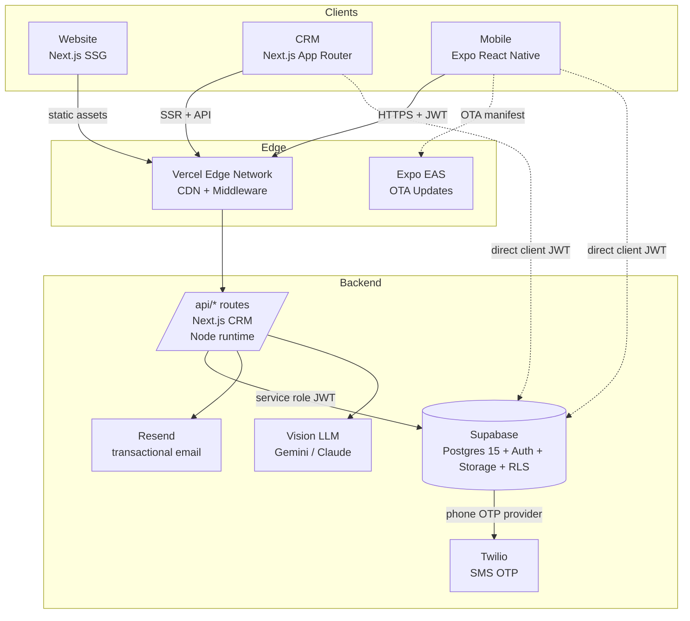
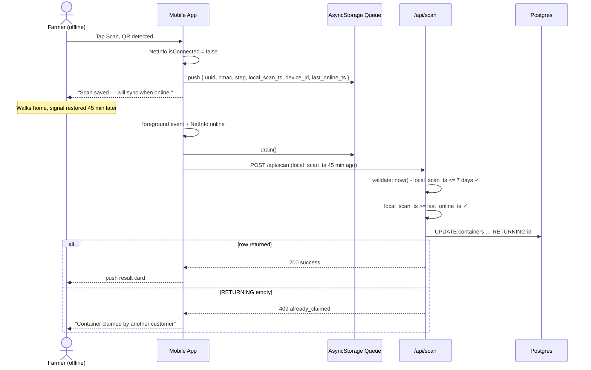

# GAIA / GABI Steward 2.0 — Technical Specification

**Author:** Tony Stark (Engineering)
**Status:** Draft
**Last Updated:** 2026-04-24
**Reviewers:** Lisa Hayes (PRD), Ayanokoji (Design System), Light (Discovery), Rick (Product)
**PRD Reference:** `Lezzur/gabi-2.0/prd.md` (v3, 53 decisions locked, 2026-04-24)
**File:** `TECH-SPEC-gaia-2026-04-24.md`

---

## 1. Overview

GAIA (GABI Steward 2.0) is a four-surface Philippine agrochemical traceability and EPR compliance platform. Farmers scan QR-stamped containers with their mobile app to verify authenticity, dealers scan at purchase and return to complete compliance + reward flows, and regulators consume audit-ready reports from the CRM. The defining technical constraints are: (1) a **surface-agnostic REST scan endpoint** called identically by the CRM and the mobile app, (2) a **dual-confirmation state machine** protected by atomic Postgres `UPDATE…RETURNING` claims, (3) an **offline-tolerant** mobile app with a trust model that accepts device-claimed timestamps under bounded conditions, and (4) **append-only forensics** — every scan attempt, valid or invalid, written to `scan_attempts` with RLS that prohibits UPDATE and DELETE at the database level. The system is built as a Next.js + Expo monorepo on top of Supabase, with a shared tokens + i18n package keeping the three client surfaces visually and linguistically consistent from day one.

---

## 2. Context and Background

- **Current system state:** Standalone `GABI Steward v1` prototype built on Lovable; partial Supabase schema; no QR generation pipeline; no offline support; EPR reporting is manual spreadsheets. Marketing website is a static Lovable export at `preview--gabi-steward.lovable.app`.
- **Problem:** Philippine farmers have no way to verify FPA registration or detect counterfeit agrochemicals. Manufacturers cannot prove EPR compliance under RA 11898 because container returns are untracked. Dealers have no structured incentive to process returns. The existing prototype demonstrates the UX vision but lacks (a) the state machine to make scans trustworthy, (b) the offline queue required for rural connectivity, and (c) the FPA import pipeline needed to populate 31,990 registered product-crop combinations.
- **Motivation:** FPA audit cycles in 2026 are moving from spreadsheet-based to digital submissions. Brand owners have a 2026 compliance deadline. A working demo unlocks the regulatory conversations that convert this into a contracted platform.
- **Constraints:**
  - Team size: one full-stack engineer + async agent assistance; target delivery horizon — v1 MVP in 10 phases (see §12).
  - Regulatory: FPA registry is the canonical source — no live API, monthly spreadsheet ingestion only.
  - Operational: rural connectivity means the mobile app must function offline; dealers at POS are assumed online.
  - Device: mid-range Android (Samsung Galaxy A52) is the benchmark target for mobile performance.
  - Security: HMAC secret must never leave the server; product safety fields (toxicity `category`, `note_to_physician`) have zero tolerance for ML hallucination and require mandatory human verification.
- **Related systems:**
  - Supabase (Postgres 15 + Auth + Storage + RLS + Realtime)
  - Vercel (web deployments)
  - Expo EAS (mobile builds, OTA)
  - Twilio (SMS OTP for farmer auth)
  - Vision LLM (Gemini 1.5 Pro primary, Claude 3.5 Sonnet fallback)
  - Resend (transactional email for contact form + dealer invites)
  - Zebra ZD421 thermal printers at GAIA HQ for label fulfilment

---

## 3. Goals and Non-Goals

### Goals
- Ship a single `POST /api/scan` endpoint that handles all four scan steps (`purchase_dealer`, `purchase_farmer`, `return_dealer`, `return_farmer`) at p95 < 800ms under 50 concurrent requests.
- Guarantee no double-claim, no lost compliance event, and no reward double-credit under concurrent / offline / late-sync conditions — enforced by atomic `UPDATE…RETURNING` against the `containers` row.
- Complete an end-to-end offline flow: scan offline → queue in AsyncStorage → sync on reconnect → container claim within the 7-day sync cap.
- Import the 31,990-row FPA spreadsheet in ≤ 120 seconds, idempotently, preserving OCR-authored fields on re-import.
- Ship v1 with i18n infrastructure, shared design tokens, and a shared component language across CRM + mobile + website — zero day-one visual drift.
- RLS enabled on every public-schema table with a verification query in the launch checklist.

### Non-Goals
- **Pi Network / on-chain integration.** Architecture-ready (section references only); no client code in v1.
- **Device time attestation** (Play Integrity / TPM). Trust model relies on `local_scan_ts` bounds; upgrade deferred until fraud evidence warrants.
- **Manufacturer self-serve onboarding.** GAIA staff onboards manufacturers manually.
- **Retrofitting QR stickers to shelf stock.** New production batches only.
- **Live FPA API.** FPA does not expose one; monthly spreadsheet import is the permanent path.
- **Push notifications on mobile.** Post-launch.
- **Consumer (non-app) web scanner.** Mobile is the only farmer scan surface.
- **Multi-language at launch.** i18n keys mandatory from day one; English-only copy ships v1, Tagalog/Ilokano strings added post-launch without code changes.

---

## 4. Proposed Architecture

### 4.1 High-Level Design



- **Website + CRM** live behind Vercel (single `apps/website` + `apps/crm` deploy targets in the monorepo). Both are Next.js 14 with the App Router. The website is fully static (SSG); the CRM runs SSR + client-side routing with Supabase SSR helpers.
- **Mobile** is an Expo SDK 51 app (`apps/mobile`) with Expo Router and the same Supabase JS client. Over-the-air updates flow through Expo EAS so that non-native bug fixes can ship without App Store review.
- **Backend** is Next.js API routes colocated with the CRM (single Vercel project). All privileged operations — scan state machine, FPA import, OCR, QR generation, label export, reward crediting — live here, authenticated by Supabase-issued JWTs and executed with the Supabase service role key.
- **External services** are fronted by adapter modules in `packages/shared/adapters/` so that swapping providers (Twilio → Semaphore, Gemini → Claude) is a single-file change.

### 4.2 Component Details

#### Component A: Web Surfaces (`apps/website`, `apps/crm`)
- **Responsibility:** Static marketing site; CRM for dealers, brand admins, sight checkers, and GABS admins.
- **Technology:** Next.js 14 App Router, TypeScript 5.x, Tailwind CSS 3.4, `@supabase/ssr` for session-aware server components, `shadcn/ui` for CRM primitives (see §4.6 Rejected for rationale).
- **Interfaces:** HTML/CSS to browsers; Next.js API routes to scan endpoint; Supabase client directly for RLS-gated reads (product lists, wallet balances).
- **Scaling strategy:** Vercel auto-scaling for SSR; static pages served from CDN edge; no server-side state.

#### Component B: Mobile App (`apps/mobile`)
- **Responsibility:** Farmer-facing QR scanner, offline queue, wallet, scan history.
- **Technology:** Expo SDK 51+, React Native 0.74, Expo Router v3, `expo-camera`, `expo-barcode-scanner`, `expo-secure-store` (session), `@react-native-async-storage/async-storage` (offline queue), `@supabase/supabase-js`.
- **Interfaces:** Camera → QR decode → POST `/api/scan`; AsyncStorage queue → drain on foreground + NetInfo online event.
- **Scaling strategy:** Client-side only; server load scales with unique users, not app instances.

#### Component C: Scan API (`apps/crm/app/api/scan/route.ts`)
- **Responsibility:** Single entry for all four scan steps; HMAC verification, auth, FPA checks, atomic state transitions, reward crediting, forensic logging.
- **Technology:** Next.js Node runtime (NOT edge — we need `crypto.timingSafeEqual` and `pg` transactions). Supabase service role client. Zod for request validation.
- **Interfaces:** JSON POST in, JSON envelope out, writes to `containers` / `pending_*` / `wallets` / `wallet_transactions` / `scan_attempts`.
- **Scaling strategy:** Stateless handler, horizontally scalable via Vercel serverless; Postgres becomes the bottleneck and is handled in §7 (caching + indexes).

#### Component D: FPA Import Pipeline (`apps/crm/app/api/products/import-fpa/route.ts`)
- **Responsibility:** Parse FPA .xlsx, convert Excel date serials, group by registration number, upsert products + product_crops.
- **Technology:** `xlsx` npm package, streaming row iteration, 500-row batch upserts via `supabase-js`.
- **Interfaces:** Accepts multipart/form-data; returns `{ inserted, updated, skipped, errors }`.
- **Scaling strategy:** Synchronous request with 180s Vercel timeout (Pro plan); background job deferred until we see > 100k row files.

#### Component E: Vision LLM Adapter (`packages/shared/adapters/ocr.ts`)
- **Responsibility:** Uniform interface for label OCR regardless of provider.
- **Technology:** Provider module keyed by `OCR_PROVIDER` env var; currently Gemini 1.5 Pro (primary) and Claude 3.5 Sonnet (fallback).
- **Interfaces:** `extractLabel(imageBuffer): Promise<LabelExtraction>`; LabelExtraction is a strict Zod schema matching the 14 OCR fields.
- **Scaling strategy:** Provider calls are rate-limited upstream; we apply a semaphore (max 5 concurrent) to avoid request pile-up.

#### Component F: Shared Packages (`packages/shared`, `packages/supabase`)
- **Responsibility:** Cross-surface contracts — tokens, i18n, Zod schemas, adapters, generated DB types.
- **Layout:**
  ```
  packages/
    shared/
      tokens/        # platform-agnostic design tokens (JSON)
      i18n/          # en.json (and later tl.json, ilo.json)
      schemas/       # Zod schemas for scan API, FPA import, OCR
      adapters/      # ocr, sms, email
      constants/     # scan steps, outcomes, container states
    supabase/
      migrations/    # SQL migrations (one per phase)
      seed/          # seed.sql
      types/         # generated database.types.ts
  ```

### 4.3 Data Model

All timestamps are `timestamptz` stored in UTC. Clients render in `Asia/Manila` (+08:00). The schema below matches PRD §Phase 1 with one clarification (see §14 Decisions: container_state enum cleanup).

#### Entity: `products`
| Field | Type | Constraints | Description |
|---|---|---|---|
| id | uuid | PK, default `gen_random_uuid()` | Primary key |
| product_name | text | NOT NULL | FPA/label name |
| brand_name | text | | OCR/manual — post-FPA enrichment |
| company | text | NOT NULL | FPA: NAME OF COMPANY |
| active_ingredient | text | NOT NULL | FPA |
| concentration | text | | e.g. "250 g/L" |
| formulation_type | formulation_type (enum) | | EC / SC / WP / WG / SL / GR / DP / ULV / OTHER |
| type | product_type (enum) | | HERBICIDE / INSECTICIDE / FUNGICIDE / … / OTHER |
| category | toxicity_category (enum) | | 1 / 2 / 3 / 4 — safety-critical |
| fpa_registration_number | text | UNIQUE | FPA registry identifier |
| fpa_registration_expires_at | date | | FPA expiry (3-year cycle) |
| fpa_last_imported_at | timestamptz | | Stamp on every upsert |
| mode_of_entry | text | | FPA verbatim (CONTACT / SYSTEMIC / …) |
| mode_of_action_group | text | | IRAC/FRAC/HRAC — manual CRM entry |
| dosage_rate | text | | FPA |
| mrl | text | | Maximum Residue Limit |
| pre_harvest_interval | text | | PHI |
| re_entry_period | text | | FPA |
| distributor | text | | OCR |
| formulated_by | text | | OCR |
| imported_by | text | | OCR |
| timing_of_application | text | | OCR |
| note_to_physician | text | | Safety-critical (antidote) |
| pests | text | | Denormalized from FPA (pests/weeds/diseases string) |
| status | product_status (enum) | NOT NULL DEFAULT `draft` | draft / active / suspended |
| category_confirmed_by | uuid | FK → auth.users(id) | Confirming operator |
| category_confirmed_at | timestamptz | | |
| note_to_physician_confirmed_by | uuid | FK → auth.users(id) | |
| note_to_physician_confirmed_at | timestamptz | | |
| label_image_storage_path | text | | `labels/{product_id}/{ts}.{ext}` |
| created_at | timestamptz | NOT NULL DEFAULT now() | |
| updated_at | timestamptz | NOT NULL DEFAULT now() | |

**Indexes:**
- `idx_products_fpa_registration_number` on `fpa_registration_number` — unique upsert lookups on FPA import (≤ 31,990 lookups per import).
- `idx_products_status` on `status` — RLS filters `status = 'active'` on every dealer / farmer read.
- `idx_products_type` on `type` — CRM product list filter.

**Constraints:**
- CHECK: `status = 'active'` requires `category_confirmed_by IS NOT NULL AND note_to_physician_confirmed_by IS NOT NULL` — enforced via trigger (see §6 Safety Gate).

#### Entity: `product_crops`
| Field | Type | Constraints | Description |
|---|---|---|---|
| id | uuid | PK | |
| product_id | uuid | FK → products.id, ON DELETE CASCADE | |
| crop | text | NOT NULL | |
| pests | text | | Per-crop pest list |
| created_at | timestamptz | NOT NULL DEFAULT now() | |

**Indexes:** `idx_product_crops_product_id` on `product_id`; UNIQUE `(product_id, crop)`.

#### Entity: `containers`
| Field | Type | Constraints | Description |
|---|---|---|---|
| id | uuid | PK, default `gen_random_uuid()` | QR payload |
| product_id | uuid | NOT NULL, FK → products.id | |
| hmac | text | NOT NULL | Full HMAC-SHA256 hex; canonical reference |
| batch_number | text | | |
| manufacture_date | date | | |
| formulation_expires_at | date | GENERATED ALWAYS AS `(manufacture_date + INTERVAL '2 years') STORED` | Derived; not writeable |
| state | container_state (enum) | NOT NULL DEFAULT `in_distribution` | See §14 Decisions |
| purchased_by_user_id | uuid | FK → auth.users(id) | Set at farmer purchase confirmation |
| dealer_id | uuid | FK → dealer_accounts(id) | Original sale dealer |
| return_dealer_id | uuid | FK → dealer_accounts(id) | Return-processing dealer (may differ) |
| purchased_at | timestamptz | | Uses `local_scan_ts` for offline sync acceptances |
| returned_at | timestamptz | | |
| rewards_paid_at | timestamptz | | |
| created_at | timestamptz | NOT NULL DEFAULT now() | |
| updated_at | timestamptz | NOT NULL DEFAULT now() | |

**Indexes:**
- `idx_containers_state` on `state` — CRM filters by state on list views; scan queries check state.
- `idx_containers_purchased_by_user_id` on `purchased_by_user_id` — farmer scan history.
- `idx_containers_dealer_id` on `dealer_id` — dealer container list.
- `idx_containers_batch_number` on `(product_id, batch_number)` — batch-level exports.

#### Entity: `pending_purchase`
| Field | Type | Constraints |
|---|---|---|
| id | uuid | PK |
| container_id | uuid | UNIQUE, FK → containers.id |
| dealer_id | uuid | NOT NULL, FK → dealer_accounts.id |
| expires_at | timestamptz | NOT NULL DEFAULT `now() + INTERVAL '60 minutes'` |
| created_at | timestamptz | NOT NULL DEFAULT now() |

**Indexes:** `idx_pending_purchase_container` on `(container_id, expires_at)`.

**Lazy cleanup:** No cron. Every scan path that reads this row also evaluates `expires_at < now()` and deletes if stale (one DELETE per expired row, amortized).

#### Entity: `pending_return_reward`
Identical shape to `pending_purchase` except FK labels and the reward semantics (see §4.4 Scan Endpoint — Step `return_farmer`).

#### Entity: `scan_attempts` (append-only)
| Field | Type | Constraints |
|---|---|---|
| id | uuid | PK |
| container_id | uuid | Nullable — null when HMAC invalid |
| actor_id | uuid | |
| actor_type | actor_type (enum) | farmer / dealer / admin |
| step | scan_step (enum) | NOT NULL |
| outcome | scan_outcome (enum) | NOT NULL |
| hmac_valid | boolean | NOT NULL |
| auth_valid | boolean | NOT NULL |
| ip_address | inet | |
| local_scan_ts | timestamptz | Device-claimed |
| sync_ts | timestamptz | NOT NULL DEFAULT now() |
| device_id | text | |
| last_online_ts | timestamptz | |
| sync_delayed | boolean | NOT NULL DEFAULT false — set by trigger when `sync_ts - local_scan_ts > interval '5 minutes'` |
| created_at | timestamptz | NOT NULL DEFAULT now() |

**Indexes:**
- `idx_scan_attempts_container_id` on `container_id`
- `idx_scan_attempts_actor_id` on `actor_id`
- `idx_scan_attempts_created_at_desc` on `(created_at DESC)` — recent-activity queries
- `idx_scan_attempts_outcome_created` on `(outcome, created_at)` — alerting queries

**Constraints:**
- No UPDATE / DELETE grants at the role level. Enforced by: (a) RLS policy allowing only INSERT, (b) a DB event trigger that aborts on any UPDATE/DELETE against `scan_attempts` regardless of role.

#### Entity: `dealer_accounts`, `manufacturer_accounts`, `wallets`, `wallet_transactions`, `vouchers`, `reward_config`, `user_profiles`
See PRD §Phase 1 tables 1.2; schemas inherited verbatim. Notable constraints:

- `reward_config` singleton: unique partial index `CREATE UNIQUE INDEX reward_config_singleton ON reward_config ((true))` — a second INSERT aborts.
- `wallets.balance_points CHECK (balance_points >= 0)` — prevents negative balances even if a transaction bug double-debits.
- `vouchers.expires_at` required — no indefinite vouchers.

### 4.4 API Design

All endpoints mount under `apps/crm/app/api/`. JSON in, JSON out. All errors conform to a common envelope:

```json
{ "error": "UPPER_SNAKE_CODE", "message": "i18n key", "details": { } }
```

#### Endpoint: `POST /api/scan`

**Purpose:** Surface-agnostic scan handler for CRM + mobile. All four scan steps route through this single endpoint.

**Request:**
```json
{
  "uuid": "c6e4b2f3-7e92-4a51-9c2a-3b8a1f0c5e22",
  "hmac": "bf2a8c16b30e7e9f",
  "step": "purchase_farmer",
  "local_scan_ts": "2026-04-24T11:05:13+08:00",
  "device_id": "expo:android:a52:7f39",
  "last_online_ts": "2026-04-24T09:47:02+08:00",
  "condition_confirmed": false
}
```

**Response (200):**
```json
{
  "outcome": "success",
  "container": {
    "id": "c6e4b2f3-...",
    "state": "purchased",
    "formulation_expires_at": "2027-06-12",
    "formulation_months_remaining": 14
  },
  "product": {
    "product_name": "Macho 600 OD",
    "active_ingredient": "Glyphosate",
    "concentration": "480 g/L",
    "category": "3",
    "fpa_registration_number": "K-1234",
    "fpa_status": "valid",
    "note_to_physician": "Induce vomiting; administer activated charcoal.",
    "pre_harvest_interval": "21 days",
    "re_entry_period": "24 hours",
    "registered_crops": ["Rice", "Corn", "Sugarcane"]
  },
  "message": "i18n:scan.purchase.farmer_confirmed",
  "rewards_credited": null,
  "fpa_warning": false,
  "pending_expires_at": null
}
```

**Error Responses:**
| Status | outcome | Description | Client Action |
|---|---|---|---|
| 400 | INVALID_INPUT | Zod validation failed | Fix request |
| 401 | hmac_invalid | HMAC mismatch | Show counterfeit warning (red screen) |
| 401 | auth_required | Missing/expired JWT | Redirect to login |
| 403 | fpa_blocked | Dealer scan on FPA-expired product | Hard block; do not proceed with sale |
| 409 | already_claimed | Concurrent claim lost race | Show "already claimed by another customer" |
| 410 | window_expired | 60-min window elapsed (and offline criteria not met) | Ask dealer to re-initiate |
| 422 | state_mismatch | Container not in expected state | Show context-specific message |
| 422 | condition_rejected | `return_dealer` without `condition_confirmed=true` | Re-prompt dealer |
| 422 | product_draft | Safety fields unconfirmed on the product | "Product registration pending" |
| 429 | RATE_LIMITED | 10+ invalid HMAC attempts per UUID per hour | Back off |
| 500 | INTERNAL_ERROR | Unexpected server error | Retry once, alert on second failure |

**Authentication:** Supabase JWT in `Authorization: Bearer <token>` header. Service role used internally; never issued to clients.
**Rate Limit:** 60 req/min/IP at Vercel edge; additionally, the scan handler checks an in-memory LRU of invalid-HMAC attempts per UUID (threshold: 10/hour → lock that UUID for 1 hour with a 429 response).
**Idempotency:** Not idempotent. Each call is a real side effect. Clients that need retry safety include a `device_id` and the server dedupes via `(device_id, container_id, step, local_scan_ts)` matching a row already in `scan_attempts` within the last 10 minutes.

**Algorithm (all steps):**
1. Zod-validate request body.
2. Verify HMAC: `crypto.timingSafeEqual(computed, provided)`. On mismatch → insert scan_attempt (container_id NULL, hmac_valid=false, outcome=hmac_invalid) → 401.
3. Verify JWT. On failure → insert scan_attempt (auth_valid=false) → 401.
4. Resolve container by UUID; if not found → state_mismatch (422).
5. Lazy-delete any `pending_purchase` or `pending_return_reward` row for this container with `expires_at < now()`.
6. Branch by `step`:

```mermaid
sequenceDiagram
  actor D as Dealer (CRM)
  actor F as Farmer (Mobile)
  participant API as /api/scan
  participant DB as Postgres

  Note over D,F: PURCHASE FLOW
  D->>API: step=purchase_dealer
  API->>DB: HMAC+auth+FPA checks
  alt FPA expired
    API-->>D: 403 fpa_blocked
  else FPA valid
    API->>DB: INSERT pending_purchase (60min)
    API-->>D: 200 success + pending_expires_at
  end
  F->>API: step=purchase_farmer (online)
  API->>DB: BEGIN
  API->>DB: UPDATE containers SET state='purchased' WHERE state IN ('in_distribution') AND purchased_by_user_id IS NULL RETURNING id
  alt RETURNING empty
    API->>DB: COMMIT (scan_attempt only)
    API-->>F: 409 already_claimed
  else row returned
    API->>DB: DELETE pending_purchase
    API->>DB: COMMIT
    API-->>F: 200 success + product details
  end

  Note over D,F: RETURN FLOW
  D->>API: step=return_dealer, condition_confirmed=true
  API->>DB: BEGIN
  API->>DB: UPDATE containers SET state='returned', return_dealer_id, returned_at WHERE state='purchased' RETURNING id
  API->>DB: INSERT pending_return_reward (60min)
  API->>DB: COMMIT (EPR event fires)
  API-->>D: 200 success

  F->>API: step=return_farmer
  API->>DB: BEGIN
  API->>DB: SELECT pending_return_reward; if expired → COMMIT + return window_expired
  API->>DB: UPDATE containers SET state='rewards_paid', rewards_paid_at
  API->>DB: INSERT wallet_transactions (farmer +N, dealer +N)
  API->>DB: UPDATE wallets balance += N (both)
  API->>DB: DELETE pending_return_reward
  API->>DB: COMMIT
  API-->>F: 200 success + rewards_credited
```

**Offline acceptance (purchase_farmer only):**
```sql
-- Client sent local_scan_ts claimed in window.
-- Accept if container still unclaimed:
UPDATE containers
SET state = 'purchased',
    purchased_by_user_id = :farmer_id,
    purchased_at = :local_scan_ts
WHERE id = :container_id
  AND state IN ('in_distribution')
  AND purchased_by_user_id IS NULL
RETURNING id;
```

Additional server-side bounds before running the UPDATE:
- `now() - local_scan_ts <= '7 days'::interval`
- `local_scan_ts >= last_online_ts`
- `local_scan_ts <= now()` (no future claims)

If `RETURNING` is empty → `409 already_claimed`. Else success.

#### Endpoint: `POST /api/products/import-fpa`
Parse .xlsx, batch-upsert products + product_crops. 50MB cap. `gabs_admin` only. Returns `{ inserted, updated, skipped, errors }`. See PRD §Phase 4 for field mapping.

#### Endpoint: `POST /api/products/ocr`
Upload label image (≤ 10MB), call configured vision LLM, return extracted fields with confidence indicators. Does NOT save to `products`.

#### Endpoint: `POST /api/products/ocr/confirm`
Accept reviewed values + `category_confirmed=true` + `note_to_physician_confirmed=true`. Rejects if either flag missing. Upserts product; sets `status='active'` only if both safety gates pass.

#### Endpoint: `POST /api/containers/generate`
Generate N containers for an active product. Each: UUID v4, HMAC-SHA256 full hex, URL-compact 16-char suffix. `gabs_admin` only. Rejects draft/suspended products.

#### Endpoint: `POST /api/containers/export-labels`
`{ container_ids, format: 'pdf' | 'zpl' }`. Returns binary. PDF is 4×6 inch per label (Zebra GK420/ZD420 compatible). ZPL is direct printer commands.

#### Endpoint: `POST /api/contact`
Website contact form. Rate-limited 5/IP/hour. Delivers via Resend.

### 4.5 Design System Architecture (resolves Ayanokoji's 4 concerns)

#### Tokens (cross-platform, single source)
```
packages/shared/tokens/
  colors.json
  typography.json
  spacing.json
  radii.json
  shadows.json
  transitions.json
  index.ts          // re-exports + types
  tailwind.ts       // Tailwind theme.extend plugin
  rn.ts             // { colors, spacing, radii } for StyleSheet
```

Example `colors.json`:
```json
{
  "primary": "#1A3D2E",
  "primary_hover": "#143024",
  "surface": "#F5EDD8",
  "accent": "#C8952A",
  "success": "#2E7D32",
  "warning": "#F57C00",
  "error": "#C62828",
  "text_primary": "#1C1C1C",
  "text_secondary": "#6B6B6B",
  "border": "#E0D8CC"
}
```

Consumed by:
- `apps/website/tailwind.config.ts` → `theme.extend = sharedTokens.tailwind`
- `apps/crm/tailwind.config.ts` → same plugin
- `apps/mobile/src/theme.ts` → `export const theme = sharedTokens.rn`

#### Component library (CRM)
**Decision: `shadcn/ui`** on top of Radix primitives and Tailwind. Covers Table, Form, Toast, Badge, Dialog, Tabs, Tooltip, Skeleton — all required by PRD §7.8. Installed via CLI (source-owned components, tree-shakeable). Cost of building from scratch: ~2 weeks with no architectural benefit.

#### Tokens beyond color/typography (spacing, radii, shadows, transitions)
Explicitly defined in `packages/shared/tokens/`:
- `spacing`: 4-based scale `{ 1: 4, 2: 8, 3: 12, 4: 16, 6: 24, 8: 32, 12: 48, 16: 64, 24: 96 }`
- `radii`: `{ sm: 4, md: 6, lg: 8, xl: 12, pill: 9999 }`
- `shadows`: `{ sm, md, lg }` — Tailwind-compatible strings; RN consumers map to `elevation` + shadow props
- `transitions`: `{ fast: '150ms', base: '200ms', slow: '300ms' }` (unused on RN; web only)

#### i18n architecture
```
packages/shared/i18n/
  en.json           # v1 source
  tl.json           # post-launch
  ilo.json          # post-launch
  keys.ts           # TypeScript union of all keys for compile-time safety
```

- **Web surfaces:** `next-intl` reads from `packages/shared/i18n/en.json`.
- **Mobile:** `i18next` + `expo-localization` reads from the same file.
- **Key convention:** dot-separated, domain-first — `scan.purchase.dealer_confirmed`, `scan.return.window_expired`, `ocr.safety_gate.category_confirm_label`, `errors.hmac_invalid`.
- **Compile-time validation:** `keys.ts` generates a TS union from the JSON at build time; all `t('…')` calls typecheck against the union.

### 4.6 Alternatives Considered

| Option | Rejected because |
|---|---|
| **Embedded QR data (product info + expiry in payload)** | QR cannot be revoked; bypasses state machine; trivial forgery via QR regeneration. |
| **Client-side HMAC generation** | Secret would have to ship to the client; catastrophic. |
| **Live FPA API** | FPA does not expose one; monthly .xlsx is the permanent path. |
| **Cron-based pending expiry cleanup** | Lazy evaluation on scan is O(1) extra work per scan and avoids out-of-band mutation races. Adds operational surface for no benefit. |
| **Bluetooth / NFC co-presence proof** | Rural Android fleet doesn't support it reliably; increases onboarding friction. |
| **Cryptographic pending-nonce handshake at purchase** | Overkill for v1 threat model; dual-confirmation + 60-min window + RLS is sufficient. |
| **Separate microservices per surface** | One Next.js project ships faster, shares adapters, and hits our perf targets. Revisit at 100k DAU. |
| **Building CRM components from scratch** | 2 weeks of yak-shaving for zero architectural benefit. shadcn/ui gives us ownership of the code with Radix's accessibility defaults. |
| **Full-text search via Algolia or Meilisearch** | Not needed for v1; Postgres `pg_trgm` is plenty for product list search at 5,000 rows. |
| **Per-app i18n files** | Guaranteed drift between CRM and mobile; shared key namespace in `packages/shared/i18n/` eliminates it. |
| **Redux / Zustand for mobile state** | Expo Router + React Query (`@tanstack/react-query`) handle it. Avoid premature state libraries. |

---

## 5. Data Flow — Key Sequences

### 5.1 Farmer purchase (fully online)
Covered in §4.4 Mermaid.

### 5.2 Farmer purchase (offline, syncs 45 minutes later)


### 5.3 Dealer return scan (EPR compliance fires immediately)
```mermaid
sequenceDiagram
  actor D as Dealer
  participant CRM
  participant API
  participant DB as Postgres

  D->>CRM: Scan return QR + confirm checklist
  CRM->>API: step=return_dealer, condition_confirmed=true
  API->>DB: BEGIN
  API->>DB: UPDATE containers SET state='returned', returned_at, return_dealer_id WHERE state='purchased' RETURNING id
  alt RETURNING empty
    API->>DB: ROLLBACK
    API-->>CRM: 422 state_mismatch
  else
    API->>DB: INSERT pending_return_reward (60min)
    API->>DB: COMMIT
    Note right of DB: EPR event logged; compliance independent of farmer
    API-->>CRM: 200 success + pending_expires_at
  end
```

---

## 6. Security Considerations

- **Authentication:**
  - Farmers: Supabase phone OTP via Twilio. 10-min code expiry, 3 attempts → 5-min lockout.
  - CRM users (dealer / brand_admin / sight_checker / gabs_admin): Supabase email + password; magic-link invite for onboarding.
  - Session persistence: Expo SecureStore on mobile, httpOnly cookies on web via `@supabase/ssr`.
- **Authorization:**
  - Role claims on JWT (`user_profiles.role` → JWT `app_metadata.role`).
  - Every API route runs a middleware check that extracts JWT, verifies role, and rejects with 403 before business logic.
  - RLS policies on every table (PRD §Phase 2 items 6–24). Launch checklist runs `SELECT tablename, rowsecurity FROM pg_tables WHERE schemaname='public'` — all rows must be `true`.
- **Data protection:**
  - At rest: Supabase-managed Postgres encryption; Supabase Storage server-side encryption for label images.
  - In transit: HTTPS everywhere; TLS 1.3 on Vercel; `expo-secure-store` encrypts session tokens on device.
  - PII: phone numbers are the primary farmer identifier — scoped to RLS-gated reads only. No logs contain full phone numbers; masked as `+63 9XX XXX X###`.
- **Input validation:**
  - Zod schemas for every API route body, in `packages/shared/schemas/`.
  - File uploads validated server-side (MIME + magic bytes, not extensions); size cap enforced pre-parse.
  - `xlsx` parser run with `{ cellDates: false, raw: true }` — numeric serials converted deterministically in app code.
- **Audit logging:**
  - `scan_attempts` (append-only) — forensic trail of every scan.
  - `wallet_transactions` — immutable ledger of point credits/debits.
  - Supabase Auth logs cover login/logout/OTP attempts.
  - Retention: 24 months for `scan_attempts`, indefinite for `wallet_transactions`.
- **Secrets management:**
  - Vercel env vars (production / preview / development), including `HMAC_SECRET`, `SUPABASE_SERVICE_ROLE_KEY`, `TWILIO_AUTH_TOKEN`, `RESEND_API_KEY`, `GEMINI_API_KEY`, `CLAUDE_API_KEY`.
  - Expo EAS uses a separate set (`EXPO_PUBLIC_SUPABASE_URL`, `EXPO_PUBLIC_SUPABASE_ANON_KEY` — never service role).
  - Rotation: `HMAC_SECRET` rotated only in controlled maintenance windows (rotating breaks existing QRs unless we ship a dual-verify path; deferred until launch+6 months).
- **Threat model (top 5):**
  1. **QR UUID enumeration.** Mitigation: HMAC required on every request; UUID-alone requests return 401. Plus rate-limit: 10 invalid HMACs per UUID per hour → 429.
  2. **Aisle-scanning DoS by farmers.** Mitigation: dual-confirmation — no `pending_purchase` exists without a dealer scan, so the farmer's scan alone accomplishes nothing.
  3. **Cross-farmer claim hijack after offline sync.** Mitigation: atomic `UPDATE…RETURNING` on `containers` — first write wins, second gets 409; no silent overwrites.
  4. **Counterfeit QR forgery.** Mitigation: HMAC-SHA256 with server-held secret; `timingSafeEqual` comparison; red-screen UX on failure.
  5. **Privilege escalation via tampered JWT.** Mitigation: Supabase verifies JWT signatures; `role` is in `app_metadata` (server-set), not `user_metadata` (user-settable).

---

## 7. Performance and Scalability

### Latency targets
| Operation | p50 | p95 | p99 |
|---|---|---|---|
| `POST /api/scan` (online) | 180ms | 500ms | 800ms |
| `POST /api/scan` (offline sync) | 300ms | 800ms | 1200ms |
| Product detail screen (mobile) | 600ms | 1500ms | 2000ms |
| CRM dashboard LCP | 1200ms | 2500ms | 3500ms |
| FPA import (31,990 rows) | 90s | 120s | 180s |
| QR batch generation (1,000) | 4s | 10s | 15s |
| Label export (1,000, PDF) | 15s | 30s | 45s |
| Compliance report (12-month range) | 2s | 5s | 8s |

### Throughput targets
- Launch (month 1): 10 scan req/sec sustained, 50 burst
- Month 6: 40 req/sec sustained, 150 burst
- Month 12: 100 req/sec sustained, 400 burst
- Postgres connection budget at month 12: ≤ 80 concurrent (Supabase Pro pooler)

### Resource estimates
- **Postgres:** starts on Supabase Free (2GB, 500 connections pooled), upgrades to Pro at first real launch. Month 12 storage: ~4GB (dominated by `scan_attempts` at ~50 bytes × 10M rows).
- **Vercel:** Hobby-tier for website; Pro for CRM (serverless function timeout 60s, 180s with `maxDuration` override for FPA import).
- **Expo EAS:** 1-2 builds/week; $29/mo Production tier.
- **Supabase Storage:** label images ~500KB avg × 200/month × 24 months ≈ 2.4GB.

### Caching strategy
- **CDN:** Vercel edge caches static website pages (Cache-Control: `public, max-age=3600, s-maxage=86400, stale-while-revalidate=604800`).
- **Product data in CRM:** React Query with 5-min staleTime. Invalidated on edit.
- **Mobile scan result:** not cached — every scan hits the server. Post-scan product payload cached in RAM (React Query) for the session.
- **FPA spreadsheet re-import:** compute SHA256 of uploaded file; if matches last import's hash, short-circuit with "identical file — no changes applied." Saves 120s on accidental re-upload.
- **Generated types:** `database.types.ts` checked into `packages/supabase/types/` — regenerated on every migration; not fetched at runtime.

### Bundle splitting
- **Website:** SSG static exports; no client JS on pages that don't need it.
- **CRM:** Next.js App Router route-level splitting; `dynamic()` for the scanner page (`html5-qrcode` is ~40KB gzipped and only loads on the scan route).
- **Mobile:** Hermes engine enabled; Metro tree-shakes; no large libs (no Moment, no Lodash — use `date-fns/sub` and native Array methods).

### Query optimization
- Every high-frequency query (scan endpoint) uses a single JOIN at most (`containers JOIN products`); prepared via a database function `fn_resolve_container(uuid)` that returns the composite row in one round trip.
- Reward crediting inside a Postgres transaction: 1 UPDATE on `containers`, 2 INSERT on `wallet_transactions`, 2 UPDATE on `wallets`, 1 DELETE on `pending_return_reward` — 6 statements, one RTT via `supabase.rpc('credit_return_rewards', {...})`.

### Load testing plan
- **Tool:** k6 scripts in `tools/k6/` — `scan-happy-path.js`, `scan-concurrent-offline-sync.js`, `fpa-import.js`.
- **Scenarios:**
  1. 50 concurrent dealers running `purchase_dealer` → matched farmers running `purchase_farmer`: verify p95 < 800ms.
  2. 100 concurrent offline-sync requests on the same UUID: exactly one succeeds, 99 receive 409.
  3. FPA import of a 31,990-row file: verify 120s completion and memory usage < 512MB.

---

## 8. Reliability and Failure Handling

### Dependency Failure Matrix
| Dependency | Failure Mode | Detection | Fallback | Recovery |
|---|---|---|---|---|
| Supabase Postgres | Connection pool exhaustion | 500s + pool metric | Reject with 503 + exponential backoff header | Supabase auto-restores; we increase pool size |
| Supabase Auth | OTP provider down (Twilio) | OTP send returns 5xx | Display "SMS unavailable — try again" — **no degraded auth path** | Twilio incident page; manual fallback to Semaphore SMS provider via env var flip |
| Vercel edge / serverless | Cold start > 5s | p99 alert | None — Vercel handles retries; we log slow starts | Provisioned concurrency on `/api/scan` if observed > 1% |
| Vision LLM (Gemini) | Timeout / 5xx | Response > 30s or non-200 | Fail over to Claude via `OCR_PROVIDER=claude` | Operator enters fields manually; LLM is convenience only |
| Resend email | Contact form / invite send failure | API 5xx | Queue in `outbound_email` table (new), retry with exponential backoff up to 24h | Manual invite via admin |
| Expo EAS | Build failures | EAS status page | Non-urgent — mobile ships updates weekly | Roll back OTA to previous runtime version |

### SLOs
| Metric | Target | Measurement | Alert Threshold |
|---|---|---|---|
| Scan API availability | 99.9% | Vercel uptime + synthetic checks | < 99.5% over 24h → page |
| Scan API error rate (5xx) | < 0.5% | Vercel analytics | > 1% for 10min → page |
| Scan API latency p99 | < 800ms | Vercel analytics | > 1500ms for 15min → warn |
| Offline sync success rate | ≥ 98% | `scan_attempts` where `sync_delayed=true` | < 95% over 48h → investigate |
| FPA import success | 100% (errors rowwise only) | Import summary | Any import with > 10% error rows → page |

### Disaster Recovery
- **RPO:** 1 hour (Supabase Pro PITR provides 7-day continuous backups).
- **RTO:** 4 hours for full region-level disaster (restore from PITR to a new Supabase project + DNS flip).
- **Backup strategy:**
  - Supabase PITR enabled (Pro tier).
  - Weekly logical dump via `supabase db dump` stored in Cloudflare R2 (cross-provider for independence); retained 90 days.
  - Label images (Supabase Storage): weekly rsync to R2 mirror.
  - Disaster drill: run `supabase db dump | supabase db reset --restore` against staging every quarter.

---

## 9. Observability

### Logging
- **Format:** Structured JSON via `pino`. Fields: `ts`, `level`, `reqId`, `route`, `userId` (hashed), `outcome`, `latencyMs`, `err.code`.
- **Key events logged:**
  - Every scan attempt (via `scan_attempts` — DB is the log).
  - Every FPA import (start, per-batch progress, completion summary).
  - Every OCR call (provider, latency, null count).
  - Every wallet credit / debit.
  - Every auth failure.
- **PII handling:**
  - Phone numbers masked before log write (`+63 9** *** *###`).
  - Label images never logged.
  - JWTs never logged (only `userId`).

### Metrics
| Metric | Type | Labels | Purpose |
|---|---|---|---|
| `gaia_scan_duration_seconds` | Histogram | step, outcome | Track latency per scan step |
| `gaia_scan_outcome_total` | Counter | step, outcome | Outcome distribution |
| `gaia_fpa_import_rows_total` | Counter | result (inserted/updated/skipped/error) | Import health |
| `gaia_ocr_latency_seconds` | Histogram | provider, result | LLM SLO tracking |
| `gaia_wallet_credit_total` | Counter | kind (farmer/dealer) | Reward volume |
| `gaia_offline_queue_drain_seconds` | Histogram | items_count_bucket | Mobile sync performance |

Exported via Vercel analytics + a sidecar `/api/metrics` that emits OpenMetrics for scraping (Grafana Cloud tier).

### Alerts
| Alert | Condition | Severity | Response |
|---|---|---|---|
| Scan API 5xx spike | > 1% for 5 min | Critical | Page on-call |
| Invalid HMAC flood on single UUID | > 10 attempts/hour | Warning | Auto-429 that UUID, alert dashboard |
| FPA import errors | > 10% of rows failed | Warning | Investigate within 1 business day |
| OCR provider timeouts | > 20% of calls | Warning | Flip `OCR_PROVIDER` env var |
| Wallet balance inconsistency | Sum of `wallet_transactions` ≠ `wallets.balance_points` | Critical | Page — potential double-credit bug |

---

## 10. Testing Strategy

- **Unit tests (Vitest):** 80% line coverage minimum on `packages/shared/` and all `/api/*` route logic. HMAC verifier, Zod schemas, Excel date conversion, offline acceptance bounds, reward crediting math.
- **Integration tests (Vitest + Supabase local dev):** `supabase start` spins up Postgres; migrations run; tests hit real `/api/*` routes against real DB. Covers: full purchase flow, full return flow, FPA import idempotency, offline sync race, RLS enforcement.
- **Contract tests:** Zod schemas shared between clients and server; mismatches caught at compile time.
- **E2E tests (Playwright for web, Detox for mobile):** 7 scenarios from PRD §Phase 10.1 — purchase, return, FPA block, window expiry, offline sync, OCR pipeline, FPA import round-trip.
- **Load tests (k6):** See §7.
- **Chaos tests:**
  1. Kill Postgres mid-return-flow → verify no partial state (transaction rolls back cleanly).
  2. Simulate Twilio 503 during OTP send → verify user gets clear error, no orphaned `auth.users` rows.
  3. Vision LLM 30s timeout → operator falls through to manual input, no hang.
- **Manual QA:**
  - Label export on physical Zebra ZD421 — verify QR readability, stick-test on polypropylene in humid conditions.
  - Mobile offline flow on a real Samsung Galaxy A52 with airplane mode toggling.
  - Camera permission denial UX on iOS and Android.

---

## 11. Deployment and Rollout

### Environments
| Environment | Purpose | Data | Access |
|---|---|---|---|
| `development` | Local engineer work | Seed data, throwaway | Engineers |
| `preview` (Vercel) | Per-PR preview | Shared staging DB | Engineers + Rick |
| `staging` | Integration + E2E | Anonymized production clone | Engineers + GAIA staff |
| `production` | Live | Real | Restricted; Vercel + Supabase admin only |

### Migration Plan
1. **Supabase migrations** managed via `supabase/migrations/` (one file per PRD phase: `20260424_001_schema.sql`, `20260425_002_rls.sql`, etc.). `supabase db push` in CI for staging; manual `supabase db push --linked` for production (peer-reviewed PR required).
2. **Reversibility:** Every migration file has a sibling `.down.sql` with the reverse. Only `up.sql` is auto-run; down migrations are manual safety net only.
3. **Backward compatibility:** Schema changes go through an additive + deprecation cycle — new column added, code updated to read both, old column dropped in a later migration.

### Rollout Strategy
- **Method:** Vercel Git-integration: every merge to `main` deploys to production. Feature flags (via LaunchDarkly or a simple `feature_flags` DB table) gate user-facing behavior.
- **Stages for mobile:**
  1. Internal alpha (EAS internal distribution) — GAIA staff only, 1 week soak.
  2. Closed beta (TestFlight + Play Internal Testing) — 10 real dealers + 20 real farmers, 2 weeks.
  3. Production (App Store + Play Store submission).
- **Stages for CRM/web:** canary via Vercel preview URL, then main deploy; no percentage rollout (single-tenant CRM).
- **Success criteria per stage:**
  - No P0 bugs for 72h.
  - Scan p99 < 1s.
  - Zero `scan_attempts` with unexpected outcome enum values.
- **Rollback trigger:** P0 bug / SLO breach.
- **Rollback procedure:** `vercel rollback` for web (one command, < 60s). For mobile: EAS OTA rollback to previous runtime; for native-changed builds, re-submit previous binary to stores.

### Feature Flags
| Flag | Purpose | Default | Cleanup Date |
|---|---|---|---|
| `offline_sync_enabled` | Gate mobile offline queue at launch | on | after 30 days |
| `ocr_provider` | Gemini vs Claude | `gemini` | — (permanent toggle) |
| `fpa_hard_block_enabled` | Emergency disable dealer FPA block | on | — |
| `reward_crediting_enabled` | Pause rewards if ledger inconsistency found | on | — |

---

## 12. Implementation Plan

Milestones map 1:1 to PRD phases. Each is independently deployable — no phase blocks a prior merge.

| Milestone | Description | Deliverable | Dependencies |
|---|---|---|---|
| M1 | DB schema + migrations | All tables, enums, indexes, FKs; seed data validates schema | — |
| M2 | Auth + RLS | Phone OTP for farmers; email/password for CRM; RLS on every table | M1 |
| M3 | Scan API state machine | `POST /api/scan` for all 4 steps, atomic transitions, offline sync | M1, M2 |
| M4 | FPA import pipeline | `POST /api/products/import-fpa` handles 31,990-row file idempotently | M1, M2 |
| M5 | OCR label ingestion | `POST /api/products/ocr` + `/ocr/confirm` with safety gate | M1, M2 |
| M6 | QR generation + label export | `POST /api/containers/generate` + `/export-labels` PDF+ZPL | M1, M2, M3 |
| M7 | CRM surface | Product mgmt, container mgmt, dealer scan, reports, wallets | M1–M6 |
| M8 | Mobile app | Phone OTP, scanner, offline queue, wallet, history | M1, M2, M3, M6 |
| M9 | Website | 6 pages, design-system consumer, contact form | design tokens from M7 |
| M10 | Integration + launch | E2E suites pass, security checklist, load tests, deploys | M1–M9 |

### Work Breakdown (critical path)
1. Monorepo skeleton (Turborepo + pnpm workspaces, 1 day)
2. `packages/shared/tokens/` + `packages/shared/i18n/` bootstrapped (1 day)
3. M1 Supabase migrations + seed (2 days)
4. M2 RLS policies + Phone OTP wiring (2 days)
5. M3 scan endpoint (4 days — this is the riskiest)
6. M4 FPA parser (2 days)
7. M5 OCR adapter + review UI (3 days)
8. M6 QR generation + label export (2 days)
9. M7 CRM (8 days; parallel with later phases)
10. M8 Mobile (7 days; parallel with M9)
11. M9 Website (3 days)
12. M10 Integration + launch hardening (5 days)

Parallelism assumption: tasks marked "parallel with" run concurrently with another engineer / agent.

---

## 13. Open Questions

| # | Question | Owner | Due | Decision |
|---|---|---|---|---|
| 1 | Final point values for farmer + dealer per return | Rick | pre-launch | Configurable in `reward_config`; default 100/50 |
| 2 | Voucher denominations + redemption partners | Rick | pre-launch | Dealer-network discount vouchers v1 |
| 3 | Primary OCR provider — Gemini or Claude in prod | Engineering | M5 start | Start Gemini (cheaper), keep Claude wired |
| 4 | SMS provider if Twilio pricing blows the budget | Rick + Engineering | M8 start | Semaphore.ph as named fallback |
| 5 | Zebra printer model confirmation | GAIA ops | M6 start | Default ZD421; ZPL tested against GK420 also |
| 6 | Exact `DEMO_URL` for website CTA | Rick | M9 | Probably CRM login with demo credentials |

---

## 14. Appendix

### Glossary
- **EPR:** Extended Producer Responsibility — regulatory framework requiring manufacturers to track and recover their product packaging.
- **FPA:** Fertilizer and Pesticide Authority of the Philippines.
- **HMAC:** Hash-based Message Authentication Code — here, SHA-256 of the container UUID with a server-held secret.
- **Lazy evaluation (pending records):** Expired rows are detected and removed by the next scan operation that reads them — no cron.
- **Dual-confirmation:** A transaction requiring both a dealer scan and a farmer scan within a 60-minute window. Dealer scan creates a `pending_*` record; farmer scan converges it.
- **pending_purchase / pending_return_reward:** Sidecar tables that hold the in-flight transaction state. They are the authoritative gate for whether a farmer scan can succeed — the container state itself tracks only committed transitions.
- **Surface-agnostic scan endpoint:** A single `/api/scan` route serves both CRM (dealer) and mobile (farmer) — no surface-specific code paths.

### Reference links
- PRD v3: `Lezzur/gabi-2.0/prd.md` (53 decisions)
- PRD detail (Lisa's alt format): `Lezzur/gabi-2.0/PRD-gaia-v1.md`
- Discovery doc: `Lezzur/gabi-2.0/DISCOVERY-gaia.md`
- FPA spreadsheet: `UPDATED-LIST-OF-REGISTERED-PRODUCTS-As-of-April-1-2026-PMID.xlsx` (31,990 rows)
- Website prototype: `preview--gabi-steward.lovable.app`

### Change history
| Version | Date | Author | Change |
|---|---|---|---|
| 0.1 | 2026-04-24 | Tony Stark | Initial draft from PRD v3 |

---

## Decisions

Tech-spec-specific decisions made during this document. These propagate to all downstream stages (API spec, UI design, build plan).

| # | Decision | Rationale / Alternative Rejected |
|---|---|---|
| TS-01 | Monorepo (`apps/website`, `apps/crm`, `apps/mobile`, `packages/*`) via Turborepo + pnpm workspaces | Shared tokens / i18n / Zod schemas; rejected multi-repo (drift). |
| TS-02 | Scan endpoint lives in CRM Next.js API routes (not a standalone service) | One Vercel project; Supabase is the real backend; microservices deferred. |
| TS-03 | Scan handler runs on Node runtime, NOT Edge | Requires `crypto.timingSafeEqual`, `pg` transactions, and `xlsx`. |
| TS-04 | `container_state` enum in PRD §Phase 1 includes `'pending_purchase'` and `'rewards_paid'`, but the PRD's state machine (Phase 3) only transitions `in_distribution → purchased → returned → rewards_paid`. `'pending_purchase'` is never assigned to `containers.state`. **Decision:** keep the enum definition to honor PRD but document that the sole authoritative pending state lives in `pending_purchase` sidecar table. The scan endpoint's atomic UPDATE matches `state IN ('in_distribution')` only. | Alternative: drop `pending_purchase` from the enum via schema migration — deferred to avoid amending the locked PRD. Zero functional impact; potential future cleanup. |
| TS-05 | `shadcn/ui` as CRM component library | Covers all PRD §7.8 component needs with Radix a11y primitives; rejected from-scratch (2 weeks zero benefit). |
| TS-06 | Shared tokens live at `packages/shared/tokens/` as platform-agnostic JSON, consumed via a Tailwind plugin on web and a StyleSheet constants file on mobile | Prevents day-1 design drift across 3 apps (Ayanokoji's concern). |
| TS-07 | Shared i18n at `packages/shared/i18n/en.json` with dot-namespaced keys; `next-intl` on web, `i18next`+`expo-localization` on mobile | Prevents per-app key drift; compile-time union of keys via `keys.ts`. |
| TS-08 | Full design-token extension (spacing, radii, shadows, transitions) — not just color + typography | PRD §9.2 only defined color/typography; tech spec fills the gap so the website and CRM don't diverge on spacing/elevation. |
| TS-09 | React Query (`@tanstack/react-query`) for all client data fetching; no Redux / Zustand | Expo Router + RQ cover state needs; avoids premature state machine. |
| TS-10 | `pino` structured JSON logging on server; mask phone numbers before write | Phone is primary farmer PII. |
| TS-11 | Rate limit: 10 invalid HMACs per UUID per hour → 429 for 1 hour | Prevents UUID enumeration at a cost that won't block legitimate retries. |
| TS-12 | FPA import file SHA256 short-circuit: if hash matches last import, skip | 120s saved on accidental re-upload. |
| TS-13 | Reward crediting executed via single Postgres RPC `credit_return_rewards(container_id, farmer_id)` | 6 statements in one transaction; single round trip. |
| TS-14 | Vercel Pro tier for CRM project (needed for `maxDuration=180` on FPA import route) | Hobby 60s cap insufficient. |
| TS-15 | Backup: Supabase PITR + weekly dump to Cloudflare R2 | Cross-provider independence for DR. |
| TS-16 | Semaphore.ph named as Twilio fallback SMS provider | Pricing risk; adapter module abstracts over both. |
| TS-17 | `HMAC_SECRET` rotation is not a v1 runbook; scheduled for launch+6 months after dual-verify path is shipped | Rotation requires two-key verification window; deferred to avoid breaking live QRs. |
| TS-18 | Server-side `last_online_ts` compared against `local_scan_ts` — reject offline sync when `local_scan_ts < last_online_ts` | Prevents client clock rollback attacks (as discussed previously in room). |
| TS-19 | Mobile: Hermes engine on; no Moment.js / Lodash in bundle | Bundle size discipline on low-end Android. |
| TS-20 | App Router SSG for website; SSR for CRM; no static export for CRM | CRM needs per-request auth context. |

---

## Review Checklist

Running the tech-spec review checklist from `skills/tech-spec/SKILL.md`:

- [x] One-paragraph overview that a non-author can read in 90 seconds
- [x] Explicit goals AND non-goals
- [x] Architecture diagram (Mermaid) with data flow narrative
- [x] Data model with fields, types, constraints, indexes
- [x] API contracts with example payloads and error matrix
- [x] At least 3 alternatives considered, with reject reasons
- [x] Security covers auth, authorization, data protection, input validation, audit, secrets, threat model
- [x] Performance has latency AND throughput targets, caching strategy, load testing plan
- [x] Dependency failure matrix with detection + fallback + recovery
- [x] SLOs are measurable and have alert thresholds
- [x] Disaster recovery has RPO + RTO + backup strategy
- [x] Observability: logs, metrics, alerts
- [x] Testing strategy covers unit, integration, contract, E2E, load, chaos, manual
- [x] Deployment has migration plan, rollout stages, rollback procedure, feature flags
- [x] Implementation plan has milestones independently deployable
- [x] Open questions have owners and due dates
- [x] Glossary defines non-obvious terms
- [x] Decisions section captures assumptions that propagate downstream

All checks pass. This spec is reviewable in one 45-minute sitting; ready for API spec + build plan downstream stages.

---

*Tech Spec — GAIA / GABI Steward 2.0*
*Author: Tony Stark · 2026-04-24*
*Source: PRD v3 (53 decisions), DISCOVERY-gaia.md v3*
